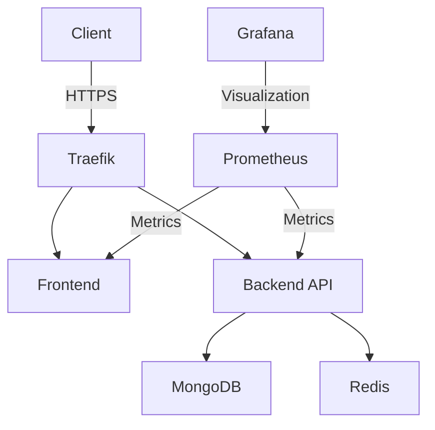

<div align="center">
  <h1>BrainBytes AI Tutoring Platform</h1>
  <p>
    <a href="https://github.com/Morfusee/MO-IT122-DevOps/actions/workflows/automation.yml">
      
    </a>
    <a href="https://github.com/Morfusee/MO-IT122-DevOps/blob/main/LICENSE">
      
    </a>
    <a href="https://nodejs.org/">
      
    </a>
    <a href="https://pnpm.io/">
      
    </a>
  </p>
</div>

## 📝 Project Description

BrainBytes is an AI-powered tutoring platform designed to provide accessible academic assistance to Filipino students. This project implements the platform using modern DevOps practices and containerization, ensuring scalability, reliability, and ease of deployment.

## 📋 Table of Contents

- [✨ Features](#-features)
- [🎯 Project Goals](#-project-goals)
- [⚙️ Technology Stack](#-technology-stack)
- [🚀 Getting Started](#-getting-started)
  - [Prerequisites](#-prerequisites)
  - [Installation](#-installation)
  - [Running the Application](#-running-the-application)
  - [Running Tests](#-running-tests)
- [🔧 Key Configuration Files](#-key-configuration-files)
- [🏗️ Project Structure](#-project-structure)
- [📊 Architecture](#-architecture)
- [📚 Documentation](#-documentation)
- [📊 Monitoring & Observability](#-monitoring--observability)
- [🐳 Docker Commands Cheatsheet](#-docker-commands-cheatsheet)
- [👥 Team Members](#-team-members)
- [📄 License](#-license)

## ✨ Features

- **AI-Powered Tutoring**: Smart learning assistance powered by advanced AI
- **Containerized Architecture**: Easy deployment with Docker
- **CI/CD Pipeline**: Automated testing and deployment
- **Monitoring**: Built-in observability tools
- **Scalable**: Microservices-based architecture for easy scaling

## 🎯 Project Goals

- [x] Implement containerized microservices architecture
- [x] Set up automated CI/CD pipeline
- [x] Deploy to production on VPS
- [x] Configure monitoring and observability
- [ ] Implement auto-scaling
- [ ] Add comprehensive test coverage

## ⚙️ Technology Stack

| Category              | Technologies                          |
|-----------------------|---------------------------------------|
| **Frontend**          | Next.js 15, React 19, TypeScript      |
| **Backend**           | AdonisJS 6, TypeScript                |
| **Database**          | MongoDB Atlas                         |
| **Containerization**  | Docker 20.10+, Docker Compose         |
| **CI/CD**             | GitHub Actions                        |
| **Infrastructure**    | Ansible, OVHCloud VPS                 |
| **Monitoring**        | Prometheus, Grafana                   |
| **Development**       | pnpm, ESLint, Prettier, Jest, Cypress |
| **API Documentation** | OpenAPI/Swagger                       |

# 🚀 Getting Started

> **Troubleshooting Tip**: Running into issues? Check out our [Troubleshooting Guide](docs/troubleshooting-guide.md) for common problems and solutions.

## Prerequisites

Before you begin, ensure you have the following installed:

- **Git** - [Download Git](https://git-scm.com/downloads)
- **Node.js** (LTS version) - [Download Node.js](https://nodejs.org/)
- **pnpm** - Install via npm:
  ```bash
  npm install -g pnpm
  ```
- **Docker Desktop** - [Download Docker Desktop](https://www.docker.com/products/docker-desktop/)
- **Docker Compose** (comes with Docker Desktop)

## 🛠️ Installation

### 1. Clone the Repository

```bash
git clone https://github.com/Morfusee/MO-IT122-DevOps.git
cd MO-IT122-DevOps
```

### 2. Set Up Environment Variables

1. Copy the example environment file:
   ```bash
   cp .env.example .env
   ```
2. Update the `.env` file with your configuration:

   ```env
   # Example .env file

   # Shared
   APP_KEY=123456789ABCDEF0

   # Backend
   TZ=UTC
   PORT=3333
   HOST=0.0.0.0
   LOG_LEVEL=info
   NODE_ENV=development
   MONGO_ATLAS_URI=
   MONGO_DOCKER_URI=
   IS_DOCKERIZED=false
   GEMINI_KEY=

   # Database
   MONGO_INITDB_ROOT_USERNAME=
   MONGO_INITDB_ROOT_PASSWORD=
   MONGO_INITDB_DATABASE=

   # Frontend
   NEXT_PUBLIC_API_BASE_URL=http://localhost:3333
   NEXT_PUBLIC_API_BASE_URL_SERVER=http://localhost:3333
   ```

> **Note**: If you want to run the monitoring stack with Docker, you must add the following variables inside a `.env` file in the `./docker` directory:
>
> ```env
> # Example .env file (monitoring stack)
> FRONTEND_URL=https://[URL]
> BASE_URL_FQDN=URL
> BASE_URL_FQDN_API=URL
> GRAFANA_URL_FQDN=URL
> DOCKER_USER_GROUP=XXX:XXX
> ```
### 3. Install Dependencies

```bash
pnpm install:all
```

## 🚀 Running the Application

### Option 1: Development Mode (Recommended for Development)

```bash
# Start backend and frontend with hot-reload
pnpm dev
```

Access the application:
- Frontend: http://localhost:3000
- Backend API: http://localhost:3333
- API Documentation: http://localhost:3333/docs

### Option 2: Docker Compose (Production-like Environment)

```bash
# Build and start all services
docker-compose up --build
```

Access the application:
- Frontend: http://localhost:3002
- Backend API: http://localhost:3001
- API Documentation: http://localhost:3001/docs

### Option 3: Development with Docker

```bash
# Start development environment with file watching
docker-compose -f docker-compose.dev.yml up --build
```

## 🧪 Running Tests

```bash
# Run all tests
pnpm test

# Run backend tests
cd backend && pnpm test

# Run frontend tests
cd frontend && pnpm test
```

### 🔑 Key Configuration Files

| File | Purpose |
|------|---------|
| [.github/workflows/automation.yml](.github/workflows/automation.yml) | CI/CD pipeline configuration |
| [docker-compose.yml](docker-compose.yml) | Development environment setup |
| [docker-compose.prod.yml](docker-compose.prod.yml) | Production deployment |
| [ansible/playbooks/playbook.yml](ansible/playbooks/playbook.yml) | Server provisioning |
| [.env.example](.env.example) | Environment variables template |


## 🏗️ Project Structure

> **Operational Note**: For detailed operational procedures and maintenance tasks, refer to our [Operational Runbook](docs/operational-runbook.md).

```
├── .github/              # GitHub Actions workflows
├── ansible/              # Infrastructure as Code (IaC)
├── backend/              # Backend API service
├── docker/               # Docker configuration files
├── docs/                 # Project documentation
├── frontend/             # Frontend application
├── simulation/           # Load testing and simulation
├── .env.example          # Environment variables template
├── docker-compose.yml    # Development environment
└── docker-compose.prod.yml # Production environment
```

### 📊 Architecture



## 📚 Documentation

Explore our comprehensive documentation to understand how **BrainBytes** is built, deployed, and maintained.

### System Design
- [System Design](docs/system-design-documentation.md) - Architecture overview, components, and data flow
- [Cloud Environment](docs/cloud-env-documentation.md) - Configuration details for hosting on a secure cloud environment

### Development
- [Docker Setup](docs/docker-dev-setup.md) - Local development with Docker
- [API Documentation](http://localhost:3333/docs) - Interactive API documentation (when running locally)

### Deployment
- [Deployment Guide](docs/deployment-plan-documentation.md) - Step-by-step deployment instructions
- [CI/CD Pipeline](docs/workflow-documentation.md) - Automated testing and deployment workflow

### Operations
- [Operational Runbook](docs/operational-runbook.md) - Comprehensive guide for day-to-day operations and maintenance
- [Troubleshooting Guide](docs/troubleshooting-guide.md) - Solutions to common issues and problems

### Monitoring
- [Monitoring System](docs/monitoring-documentation.md) - Reliability and visibility through monitoring
- [Alerts](docs/monitoring-documentation.md#4-alert-rules-documentation) - Procedures for Prometheus alerts
- [Dashboards](docs/monitoring-documentation.md#5-dashboard-catalog) - Key Grafana dashboards

### Testing
- [Simulation Guide](docs/simulation-documentation.md) - API simulation for testing and traffic generation


## 📊 Monitoring & Observability

> **Need Help?** Check the [Troubleshooting Guide](docs/troubleshooting-guide.md#-monitoring--logs) for monitoring-specific issues.

BrainBytes includes a comprehensive monitoring stack:

### Components
- **Prometheus** - Metrics collection and storage
- **Grafana** - Visualization and dashboards
- **Loki** - Log aggregation
- **Promtail** - Log collection

### Quick Start
1. Start monitoring services:
   ```bash
   docker-compose -f docker/compose.monitor.yml up -d
   ```
2. Access Grafana at `http://localhost:3001`
   - Default credentials: `admin/admin`

### Key Metrics
- Application performance
- Resource utilization
- Error rates
- Request/response times

## 🐳 Docker Commands Cheatsheet

> **For more detailed operational procedures**, including container management and deployment, see our [Operational Runbook](docs/operational-runbook.md).

| Command | Description |
|---------|-------------|
| `docker-compose up -d` | Start all services in detached mode |
| `docker-compose down` | Stop and remove all containers |
| `docker-compose logs -f` | View container logs |
| `docker-compose ps` | List running containers |
| `docker-compose exec backend bash` | Access backend container |

## 🔍 Debugging

### Common Issues

1. **Port conflicts**: Ensure ports 3000, 3001, 3002, 3333, 9090, and 9091 are available
2. **Docker issues**: Try rebuilding containers with `docker-compose build --no-cache`
3. **Dependency issues**: Delete `node_modules` and `pnpm-lock.yaml`, then run `pnpm install`

### Getting Help

If you encounter any issues, please:
1. Check the [Issues](https://github.com/Morfusee/MO-IT122-DevOps/issues) page
2. Create a new issue if your problem isn't listed
3. Contact the development team for support

## 👥 Team Members

| Role                   | Name              | Contact                    |
|------------------------|-------------------|----------------------------|
| **Team Lead**          | Kristopher Santos | lr.ksantos@mmdc.mcl.edu.ph |
| **DevOps Engineer**    | Mark Rolis Valenzuela | lr.mrvalenzuela@mmdc.mcl.edu.ph |
| **Frontend Developer** | Ibrahim Desouky Harby | lr.idesoukyharby@mmdc.mcl.edu.ph                          |
| **Backend Developer**  | Harvey Dela Flor  | lr.hdflor@mmdc.mcl.edu.ph  |

---

<div align="center">
  <p>Made with ❤️ by the BrainBytes Team</p>
</div>