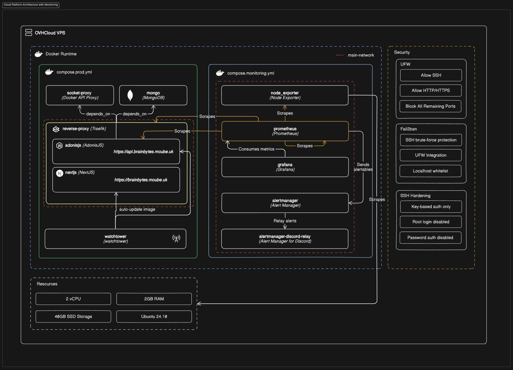
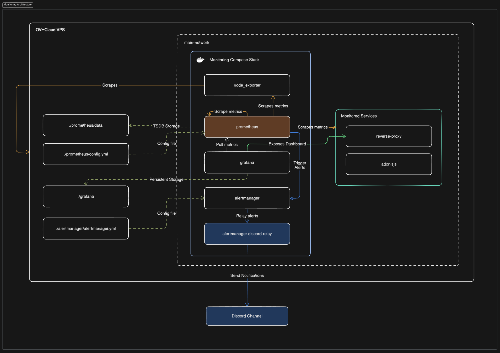
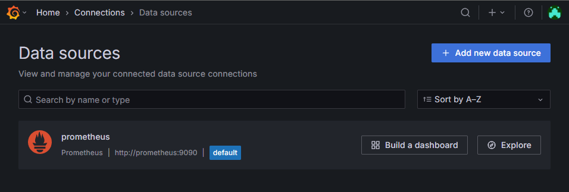
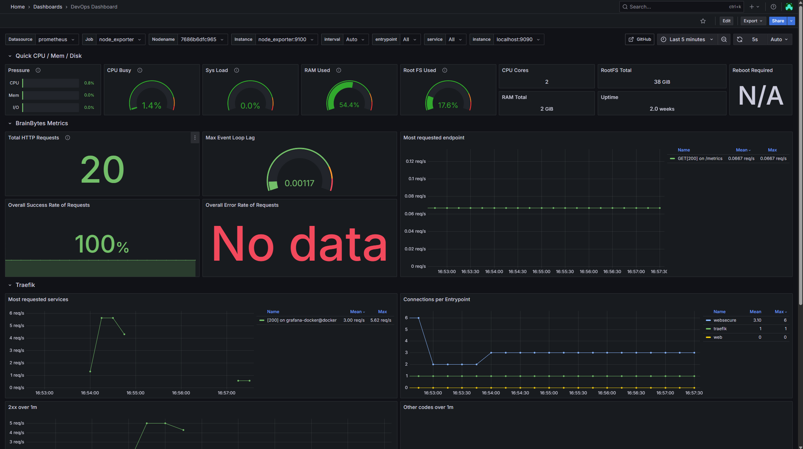
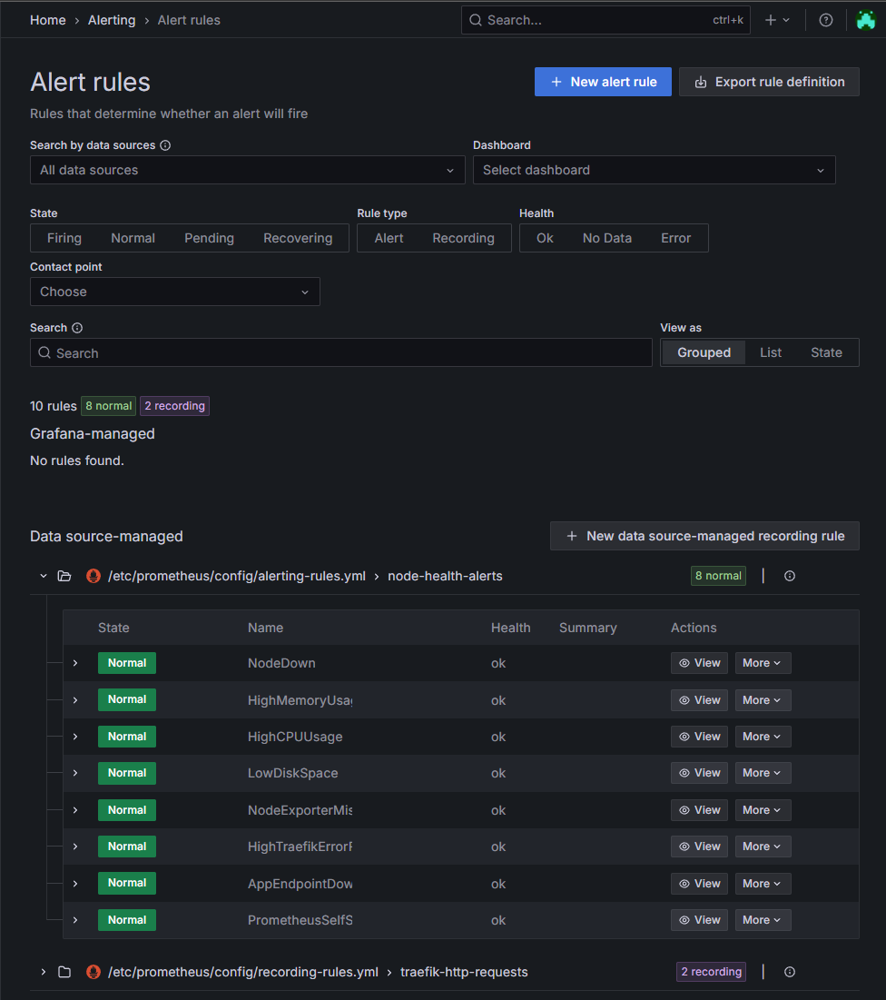

# Monitoring System Documentation

This documentation outlines the setup, configuration, and usage of the Prometheus-Grafana monitoring stack. It includes service metrics collected from custom applications, system exporters, and Traefik, along with alerting rules and visual dashboards. The goal is to ensure observability, performance tracking, and proactive issue detection across the deployed infrastructure.

---

## 1. Monitoring System Architecture Documentation



### Components Overview

| Component                          | Description                                                                                                             |
| ---------------------------------- | ----------------------------------------------------------------------------------------------------------------------- |
| **Prometheus**                     | Time-series database and metrics scraper. Configured with rules and alerting logic.                                     |
| **Grafana**                        | Visualization layer that reads from Prometheus to display metrics dashboards.                                           |
| **Node Exporter**                  | Gathers system-level metrics from host OS (CPU, memory, disk, etc.).                                                    |
| **AdonisJS App (Custom Exporter)** | Exposes application metrics via `/metrics` endpoint, including request counters, durations, and internal Node.js stats. |
| **Traefik (Reverse Proxy)**        | Exposes its own HTTP metrics at `/metrics` endpoint for monitoring HTTP traffic.                                        |
| **Alertmanager**                   | Manages alert routing and dispatching (e.g., to Discord via webhook relay).                                             |
| **alertmanager-discord-relay**     | Bridges Alertmanager webhook alerts to Discord.                                                                         |
|                                    |

### Data Flow



1. **Exporters (Node Exporter, AdonisJS, Traefik)** expose metrics via HTTP endpoints.
2. **Prometheus** scrapes each target at defined intervals (e.g., every 15s).
3. Prometheus **stores** raw time-series data in local TSDB.
4. **Recording rules** generate pre-aggregated metrics for fast querying.
5. **Alerting rules** check metrics and trigger alerts based on thresholds.
6. **Alertmanager** groups and routes alerts to the configured Discord webhook.
7. **Grafana** pulls metrics from Prometheus and renders them into dashboards for visualization.

---

## 2. Metrics Catalog

### Custom Application Metrics (AdonisJS)

| Metric                                                                                                    | Description                                     | Example Query                       |
| --------------------------------------------------------------------------------------------------------- | ----------------------------------------------- | ----------------------------------- |
| `sum(increase(_http_requests_total[$__range]))`                                                           | Total number of HTTP requests over time window. | Total requests since $\_\_range.    |
| `sum(rate(_http_requests_total{ok="true"}[$__range])) / sum(rate(_http_requests_total[$__range])) * 100`  | Percentage of successful HTTP requests.         | Success rate %.                     |
| `sum(rate(_http_requests_total{ok="false"}[$__range])) / sum(rate(_http_requests_total[$__range])) * 100` | Percentage of failed HTTP requests.             | Error rate %.                       |
| `topk(15, sum by (route, method, status) (rate(_http_requests_total[$__rate_interval])) > 0)`             | Top 15 routes by traffic.                       | Route activity insight.             |
| `nodejs_eventloop_lag_seconds`                                                                            | Current Node.js event loop lag.                 | Measures responsiveness under load. |

---

### System Metrics (Node Exporter)

| Metric                                                                         | Description                      | Example Query               |
| ------------------------------------------------------------------------------ | -------------------------------- | --------------------------- |
| `irate(node_pressure_cpu_waiting_seconds_total{...})`                          | Instant rate of CPU pressure.    | CPU wait pressure trend.    |
| `irate(node_pressure_memory_waiting_seconds_total{...})`                       | Instant rate of memory pressure. | Memory wait conditions.     |
| `irate(node_pressure_io_waiting_seconds_total{...})`                           | Instant rate of I/O pressure.    | Disk I/O bottleneck signal. |
| `irate(node_pressure_irq_stalled_seconds_total{...})`                          | Instant rate of IRQ stalls.      | Interrupt handling delay.   |
| `100 * (1 - avg(rate(node_cpu_seconds_total{mode="idle"}[$__rate_interval])))` | System-wide CPU usage.           | Overall CPU load %.         |
| `scalar(node_load1) * 100 / count(count(node_cpu_seconds_total) by (cpu))`     | Load average per core.           | CPU saturation % per core.  |
| `(1 - (MemAvailable / MemTotal)) * 100`                                        | Memory usage %.                  | Tracks available memory.    |
| `(size - avail) / size * 100`                                                  | Disk usage % (root FS)           | Filesystem saturation.      |
| `count(count(node_cpu_seconds_total) by (cpu))`                                | CPU core count.                  | Total logical CPUs.         |
| `node_memory_MemTotal_bytes`                                                   | Total memory in bytes.           | Base capacity reference.    |
| `node_filesystem_size_bytes{...}`                                              | Root filesystem total size.      | Base FS storage value.      |
| `node_time_seconds - node_boot_time_seconds`                                   | System uptime in seconds.        | Duration since last boot.   |
| `node_reboot_required`                                                         | 1 if reboot required.            | Security/patch awareness.   |

---

### Reverse Proxy Metrics (Traefik)

| Metric                                                                                                                | Description                             | Example Query                      |                                           |
| --------------------------------------------------------------------------------------------------------------------- | --------------------------------------- | ---------------------------------- | ----------------------------------------- |
| `topk(15, label_replace(sum by (service, code)(rate(traefik_service_requests_total{...})) > 0, ...))`                 | Top HTTP services by status code.       | See request volume per service.    |                                           |
| `sum(traefik_open_connections{entrypoint=~"$entrypoint"}) by (entrypoint)`                                            | Active open connections per entrypoint. | Tracks concurrent load.            |                                           |
| `topk(15, label_replace(sum by (service, method, code)(rate(traefik_service_requests_total{code=~"2.."})) > 0, ...))` | Top successful (2xx) requests.          | Most actively responding services. |                                           |
| `topk(15, label\_replace(sum by (service, method, code)(rate(traefik\_service\_requests\_total{code!\~"2..5.."}) > 0, ...))`| Top 3xx/4xx requests.           | Indicates possible routing/client issues. |

---

### Prometheus Self-Metrics

| Metric                                                    | Description                                   | Example Query                 |
| --------------------------------------------------------- | --------------------------------------------- | ----------------------------- |
| `prometheus_ready`                                        | Prometheus self-readiness.                    | Health check metric.          |
| `sum(prometheus_target_scrape_pool_targets)`              | Total number of scrape targets.               | Target discovery validation.  |
| `prometheus_notifications_alertmanagers_discovered`       | Number of discovered Alertmanager instances.  | Alert routing topology check. |
| `sum(increase(prometheus_notifications_sent_total[10m]))` | Number of alerts sent in the last 10 minutes. | Active alert volume.          |
| `rate(process_cpu_seconds_total[$__rate_interval])`       | Prometheus process CPU usage.                 | Resource usage profiling.     |

---

## 3. PromQL Query Reference Guide

| Query                                                                                                     | Purpose                                  |
| --------------------------------------------------------------------------------------------------------- | ---------------------------------------- |
| `sum(increase(_http_requests_total[$__range]))`                                                           | Total requests over time.                |
| `sum(rate(_http_requests_total{ok="true"}[$__range])) / sum(rate(_http_requests_total[$__range])) * 100`  | % of successful HTTP requests.           |
| `sum(rate(_http_requests_total{ok="false"}[$__range])) / sum(rate(_http_requests_total[$__range])) * 100` | % of failed HTTP requests.               |
| `topk(15, sum by (route, method, status)(rate(_http_requests_total[$__rate_interval]))) > 0`              | Top 15 routes by traffic.                |
| `nodejs_eventloop_lag_seconds`                                                                            | Event loop lag (Node.js responsiveness). |
| `irate(node_pressure_cpu_waiting_seconds_total{...})`                                                     | CPU pressure.                            |
| `irate(node_pressure_memory_waiting_seconds_total{...})`                                                  | Memory pressure.                         |
| `irate(node_pressure_io_waiting_seconds_total{...})`                                                      | I/O pressure.                            |
| `irate(node_pressure_irq_stalled_seconds_total{...})`                                                     | IRQ pressure.                            |
| `100 * (1 - avg(rate(node_cpu_seconds_total{mode="idle"}[$__rate_interval])))`                            | CPU usage %.                             |
| `scalar(node_load1) * 100 / count(count(node_cpu_seconds_total) by (cpu))`                                | Load per CPU.                            |
| `(1 - (MemAvailable / MemTotal)) * 100`                                                                   | Memory usage %.                          |
| `(node_filesystem_size_bytes - node_filesystem_avail_bytes) / node_filesystem_size_bytes * 100`           | Root filesystem usage %.                 |
| `count(count(node_cpu_seconds_total) by (cpu))`                                                           | Total CPU cores.                         |
| `node_time_seconds - node_boot_time_seconds`                                                              | Uptime.                                  |
| `node_reboot_required`                                                                                    | Check for pending reboots.               |
| `sum(traefik_open_connections{entrypoint=~"$entrypoint"}) by (entrypoint)`                                | Active Traefik connections.              |
| `topk(15, label_replace(sum by (service, code)(rate(traefik_service_requests_total{...})), ...))`         | Top Traefik services by requests.        |
| `prometheus_ready`                                                                                        | Prometheus health.                       |
| `sum(prometheus_target_scrape_pool_targets)`                                                              | Target count.                            |
| `sum(increase(prometheus_notifications_sent_total[10m]))`                                                 | Alerts sent.                             |
| `rate(process_cpu_seconds_total[$__rate_interval])`                                                       | Prometheus CPU usage.                    |

---

## 4. Alert Rules Documentation

### Defined Alerts

| Alert Name                  | Expression                                   | Threshold | Duration | Severity | Description                            |
| --------------------------- | -------------------------------------------- | --------- | -------- | -------- | -------------------------------------- |
| NodeDown                    | `up{job="node_exporter"} == 0`               | No data   | 1m       | critical | Node Exporter is down.                 |
| HighMemoryUsage             | `(1 - (MemAvailable / MemTotal)) * 100 > 80` | >80%      | 10s      | warning  | Memory usage exceeds threshold.        |
| HighCPUUsage                | `100 - avg(rate(idle_cpu[2m])) * 100 > 85`   | >85%      | 2m       | warning  | CPU usage is high.                     |
| LowDiskSpace                | `UsedDisk > 90%`                             | >90%      | 3m       | warning  | Disk space is running low.             |
| NodeExporterMissing         | `absent(up{job="node_exporter"})`            | none      | 1m       | critical | Node Exporter is not reporting at all. |
| HighTraefikErrorRate        | `5xx errors > 5%`                            | >5%       | 2m       | warning  | High HTTP error rate in Traefik.       |
| AppEndpointDown             | `up{job="adonisjs-app"} == 0`                | No data   | 1m       | critical | AdonisJS app is unreachable.           |
| PrometheusSelfScrapeFailing | `up{job="prometheus"} == 0`                  | No data   | 1m       | warning  | Prometheus cannot scrape itself.       |

### Response Procedures

| Alert                       | Standard Procedure                                        |
| --------------------------- | --------------------------------------------------------- |
| NodeDown                    | Verify server uptime and Prometheus target config.        |
| HighMemoryUsage             | Check app/container memory usage, restart if needed.      |
| HighCPUUsage                | Check for app overload or infinite loops.                 |
| LowDiskSpace                | Clear unused files or extend volume.                      |
| NodeExporterMissing         | Ensure service is running; check Docker logs.             |
| HighTraefikErrorRate        | Inspect service logs for 5xx error causes.                |
| AppEndpointDown             | Confirm AdonisJS is running and reachable.                |
| PrometheusSelfScrapeFailing | Ensure Prometheus instance is healthy and not overloaded. |

### Alert Grouping and Routing

- Alerts are grouped by `alertname` for clarity.
- Discord integration via:

  - `alertmanager-discord-relay`
  - Receives all alert payloads
  - Uses Discord webhook from environment variable

---

## How to Run the Monitoring Stack

1. Create external network `main-network` if not already present:

```bash
docker network create main-network
```

2. Navigate to your project root and launch the monitoring stack:

```bash
docker compose -f compose.monitor.yml up -d
```

3. Ensure you have a valid `.env` file containing:

   - `DISCORD_WEBHOOK_URL`
   - `GRAFANA_URL_FQDN`
   - `DOCKER_USER_GROUP`

4. Access Grafana:

```
https://<GRAFANA_URL_FQDN>
```

---

## Screenshot Evidence of Working Prometheus & Grafana Installation

### Prometheus Connection on Grafana



---

### Graphs from Metrics Queries



---

### Alert Rules Page

