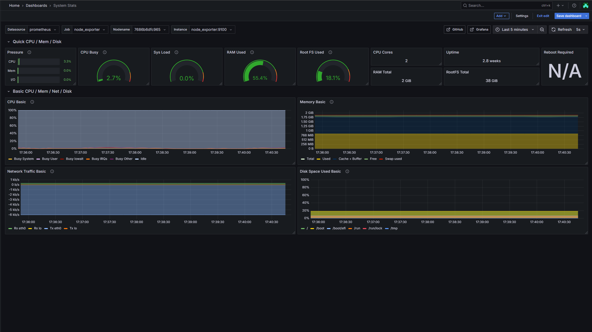
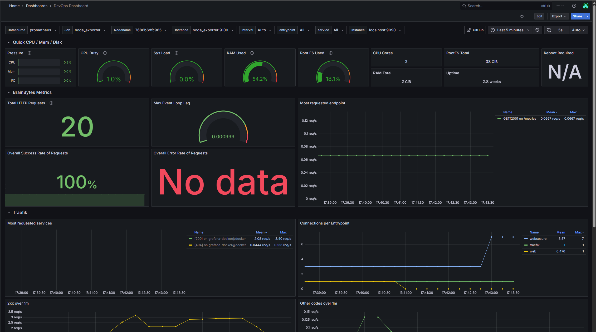
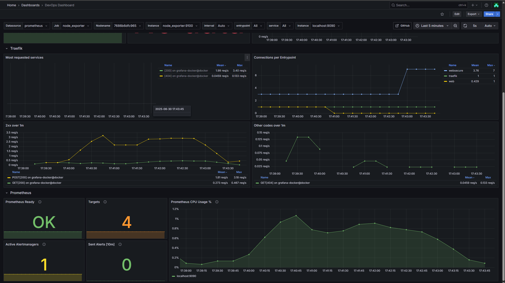
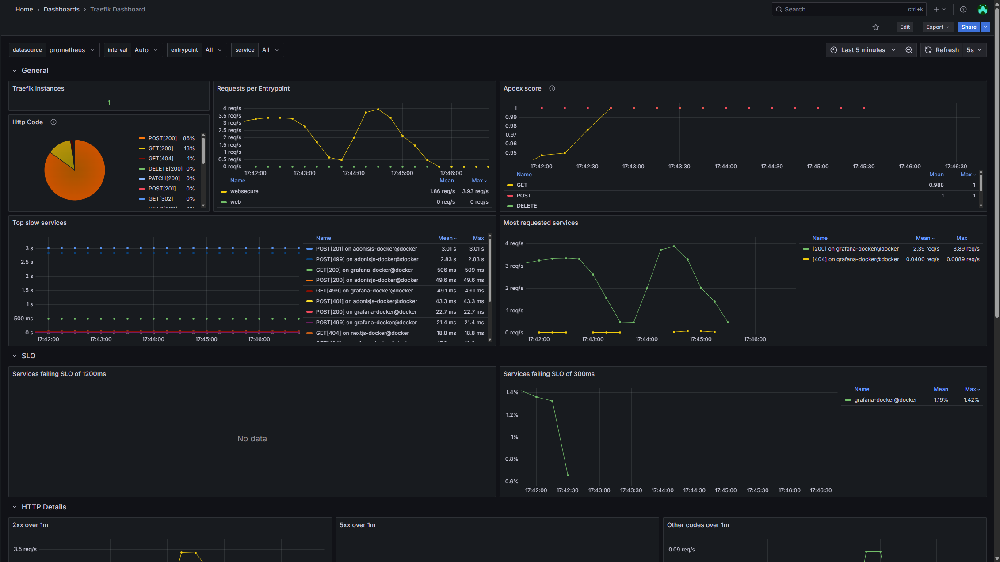
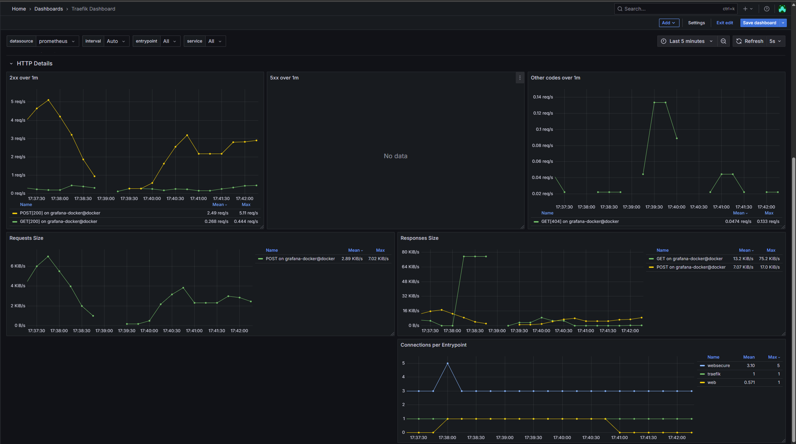

# Monitoring System Documentation

This documentation outlines the setup, configuration, and usage of the Prometheus-Grafana monitoring stack. It includes service metrics collected from custom applications, system exporters, and Traefik, along with alerting rules and visual dashboards. The goal is to ensure observability, performance tracking, and proactive issue detection across the deployed infrastructure.

---

## 1. Monitoring System Architecture Documentation


### Components Overview

| Component                  | Description                                                                                                                              |
| :------------------------- | :--------------------------------------------------------------------------------------------------------------------------------------- |
| **Prometheus** | Time-series database and metrics scraper. Configured with rules and alerting logic.                                                      |
| **Grafana** | Visualization layer that reads from Prometheus to display metrics dashboards.                                                            |
| **Node Exporter** | Gathers system-level metrics from host OS (CPU, memory, disk, etc.).                                                                   |
| **AdonisJS App (Custom Exporter)** | Exposes application metrics via `/metrics` endpoint, including request counters, durations, and internal Node.js stats.          |
| **Traefik (Reverse Proxy)** | Exposes its own HTTP metrics at `/metrics` endpoint for monitoring HTTP traffic.                                                         |
| **Alertmanager** | Manages alert routing and dispatching (e.g., to Discord via webhook relay).                                                              |
| **alertmanager-discord-relay** | Bridges Alertmanager webhook alerts to Discord.                                                                                          |

### Data Flow


1.  **Exporters (Node Exporter, AdonisJS, Traefik)** expose metrics via HTTP endpoints.
2.  **Prometheus** scrapes each target at defined intervals (e.g., every 15s).
3.  Prometheus **stores** raw time-series data in local TSDB.
4.  **Recording rules** generate pre-aggregated metrics for fast querying.
5.  **Alerting rules** check metrics and trigger alerts based on thresholds.
6.  **Alertmanager** groups and routes alerts to the configured Discord webhook.
7.  **Grafana** pulls metrics from Prometheus and renders them into dashboards for visualization.

---

## 2. Metrics Catalog

> **Note:** The following metrics are **specific to the DevOps Dashboard (Application Performance Overview)** outlined in [Section 5.2](#52-devops-dashboard-application-performance-overview). These metrics are handpicked to provide visibility into the application and system's performance and availability.


### Custom Application Metrics (AdonisJS)

| Metric                                                                      | Description                                     | Example Query                   |
| :-------------------------------------------------------------------------- | :---------------------------------------------- | :------------------------------ |
| `sum(increase(_http_requests_total[$__range]))`                             | Total number of HTTP requests over time window. | Total requests since $\_\_range. |
| `sum(rate(_http_requests_total{ok="true"}[$__range])) / sum(rate(_http_requests_total[$__range])) * 100` | Percentage of successful HTTP requests.         | Success rate %.                 |
| `sum(rate(_http_requests_total{ok="false"}[$__range])) / sum(rate(_http_requests_total[$__range])) * 100` | Percentage of failed HTTP requests.             | Error rate %.                   |
| `topk(15, sum by (route, method, status) (rate(_http_requests_total[$__rate_interval])) > 0)` | Top 15 routes by traffic.                       | Route activity insight.         |
| `nodejs_eventloop_lag_seconds`                                              | Current Node.js event loop lag.                 | Measures responsiveness under load. |

---

### System Metrics (Node Exporter)

| Metric                                                               | Description                | Example Query             |
| :------------------------------------------------------------------- | :------------------------- | :------------------------ |
| `irate(node_pressure_cpu_waiting_seconds_total{...})`                | Instant rate of CPU pressure. | CPU wait pressure trend.  |
| `irate(node_pressure_memory_waiting_seconds_total{...})`             | Instant rate of memory pressure. | Memory wait conditions.   |
| `irate(node_pressure_io_waiting_seconds_total{...})`                 | Instant rate of I/O pressure. | Disk I/O bottleneck signal. |
| `irate(node_pressure_irq_stalled_seconds_total{...})`                | Instant rate of IRQ stalls. | Interrupt handling delay. |
| `100 * (1 - avg(rate(node_cpu_seconds_total{mode="idle"}[$__rate_interval])))` | System-wide CPU usage.     | Overall CPU load %.       |
| `scalar(node_load1) * 100 / count(count(node_cpu_seconds_total) by (cpu))` | Load average per core.     | CPU saturation % per core. |
| `(1 - (MemAvailable / MemTotal)) * 100`                              | Memory usage %.            | Tracks available memory.  |
| `(size - avail) / size * 100`                                        | Disk usage % (root FS)     | Filesystem saturation.    |
| `count(count(node_cpu_seconds_total) by (cpu))`                      | CPU core count.            | Total logical CPUs.       |
| `node_memory_MemTotal_bytes`                                         | Total memory in bytes.     | Base capacity reference.  |
| `node_filesystem_size_bytes{...}`                                    | Root filesystem total size. | Base FS storage value.    |
| `node_time_seconds - node_boot_time_seconds`                         | System uptime in seconds.  | Duration since last boot. |
| `node_reboot_required`                                               | 1 if reboot required.      | Security/patch awareness. |

---

### Reverse Proxy Metrics (Traefik)

| Metric                                                                                               | Description                             | Example Query                      |
| :--------------------------------------------------------------------------------------------------- | :-------------------------------------- | :--------------------------------- |
| `topk(15, label_replace(sum by (service, code)(rate(traefik_service_requests_total{...})) > 0, ...))` | Top HTTP services by status code.       | See request volume per service.    |
| `sum(traefik_open_connections{entrypoint=~"$entrypoint"}) by (entrypoint)`                         | Active open connections per entrypoint. | Tracks concurrent load.            |
| `topk(15, label_replace(sum by (service, method, code)(rate(traefik_service_requests_total{code=~"2.."})) > 0, ...))` | Top successful (2xx) requests.          | Most actively responding services. |
| `topk(15, label_replace(sum by (service, method, code)(rate(traefik_service_requests_total{code!~"2..5.."}) > 0, ...))` | Top 3xx/4xx requests.                   | Indicates possible routing/client issues. |

---

### Prometheus Self-Metrics

| Metric                                                    | Description                             | Example Query                 |
| :-------------------------------------------------------- | :-------------------------------------- | :---------------------------- |
| `prometheus_ready`                                        | Prometheus self-readiness.              | Health check metric.          |
| `sum(prometheus_target_scrape_pool_targets)`              | Total number of scrape targets.         | Target discovery validation.  |
| `prometheus_notifications_alertmanagers_discovered`       | Number of discovered Alertmanager instances. | Alert routing topology check. |
| `sum(increase(prometheus_notifications_sent_total[10m]))` | Number of alerts sent in the last 10 minutes. | Active alert volume.          |
| `rate(process_cpu_seconds_total[$__rate_interval])`      | Prometheus process CPU usage.           | Resource usage profiling.     |

---

## 3. PromQL Query Reference Guide

| Query                                                                                                       | Purpose                                  |
| :---------------------------------------------------------------------------------------------------------- | :--------------------------------------- |
| `sum(increase(_http_requests_total[$__range]))`                                                             | Total requests over time.                |
| `sum(rate(_http_requests_total{ok="true"}[$__range])) / sum(rate(_http_requests_total[$__range])) * 100`    | % of successful HTTP requests.           |
| `sum(rate(_http_requests_total{ok="false"}[$__range])) / sum(rate(_http_requests_total[$__range])) * 100`   | % of failed HTTP requests.               |
| `topk(15, sum by (route, method, status)(rate(_http_requests_total[$__rate_interval]))) > 0`               | Top 15 routes by traffic.                |
| `nodejs_eventloop_lag_seconds`                                                                              | Event loop lag (Node.js responsiveness). |
| `irate(node_pressure_cpu_waiting_seconds_total{...})`                                                       | CPU pressure.                            |
| `irate(node_pressure_memory_waiting_seconds_total{...})`                                                    | Memory pressure.                         |
| `irate(node_pressure_io_waiting_seconds_total{...})`                                                        | I/O pressure.                            |
| `irate(node_pressure_irq_stalled_seconds_total{...})`                                                       | IRQ pressure.                            |
| `100 * (1 - avg(rate(node_cpu_seconds_total{mode="idle"}[$__rate_interval])))`                              | CPU usage %.                             |
| `scalar(node_load1) * 100 / count(count(node_cpu_seconds_total) by (cpu))`                                  | Load per CPU.                            |
| `(1 - (MemAvailable / MemTotal)) * 100`                                                                     | Memory usage %.                          |
| `(node_filesystem_size_bytes - node_filesystem_avail_bytes) / node_filesystem_size_bytes * 100`             | Root filesystem usage %.                 |
| `count(count(node_cpu_seconds_total) by (cpu))`                                                             | Total CPU cores.                         |
| `node_time_seconds - node_boot_time_seconds`                                                                | Uptime.                                  |
| `node_reboot_required`                                                                                      | Check for pending reboots.               |
| `sum(traefik_open_connections{entrypoint=~"$entrypoint"}) by (entrypoint)`                                 | Active Traefik connections.              |
| `topk(15, label_replace(sum by (service, code)(rate(traefik_service_requests_total{...})), ...))`          | Top Traefik services by requests.        |
| `prometheus_ready`                                                                                          | Prometheus health.                       |
| `sum(prometheus_target_scrape_pool_targets)`                                                                | Target count.                            |
| `sum(increase(prometheus_notifications_sent_total[10m]))`                                                  | Alerts sent.                             |
| `rate(process_cpu_seconds_total[$__rate_interval])`                                                         | Prometheus CPU usage.                    |

---

## 4. Alert Rules Documentation

### Defined Alerts

| Alert Name                  | Expression                                                                       | Threshold             | Duration | Severity | Description                                                                                   |
| :-------------------------- | :------------------------------------------------------------------------------- | :-------------------- | :------- | :------- | :-------------------------------------------------------------------------------------------- |
| `NodeDown`                  | `up{job="node_exporter"} == 0`                                                   | No heartbeat          | 1m       | `critical` | Node Exporter is down.                                                                        |
| `HighMemoryUsage`           | `(1 - (node_memory_MemAvailable_bytes / node_memory_MemTotal_bytes)) * 100 > 80` | `>80%` memory used    | 10s      | `warning`  | Memory usage on instance exceeded `80%`.                                                      |
| `HighCPUUsage`              | `100 - (avg by (instance) (rate(node_cpu_seconds_total{mode="idle"}[2m])) * 100) > 85` | `>85%` CPU usage      | 2m       | `warning`  | CPU usage on instance exceeded `85%` for 2 minutes.                                           |
| `LowDiskSpace`              | `(1 - (node_filesystem_avail_bytes{fstype!~"tmpfs|overlay"} / node_filesystem_size_bytes{fstype!~"tmpfs|overlay"})) * 100 > 90` | `>90%` disk used      | 3m       | `warning`  | Disk usage on instance exceeded `90%`.                                                        |
| `NodeExporterMissing`       | `absent(up{job="node_exporter"})`                                                | No `node_exporter` targets | 1m       | `critical` | Prometheus is not receiving metrics from any node_exporter targets.                           |
| `HighTraefikErrorRate`      | `(sum(rate(traefik_service_requests_total{code=~"5..",protocol="http"}[2m])) / sum(rate(traefik_service_requests_total{protocol="http"}[2m]))) > 0.05` | `>5%` 5xx errors      | 2m       | `warning`  | More than `5%` of HTTP requests through Traefik resulted in `5xx` errors.                     |
| `AppEndpointDown`           | `up{job="adonisjs-app"} == 0`                                                    | No `adonisjs-app` heartbeat | 1m       | `critical` | No response from AdonisJS app.                                                                |
| `PrometheusSelfScrapeFailing` | `up{job="prometheus"} == 0`                                                    | No self-scrape        | 1m       | `warning`  | Prometheus is not scraping itself.                                                            |

---

### Response Procedures

| **Alert**                     | **Description**                                                                                                                                                        | **Condition**               | **Duration** | **Severity** | **Action Message**                                                                                               |
| ----------------------------- | ---------------------------------------------------------------------------------------------------------------------------------------------------------------------- | --------------------------- | ------------ | ------------ | ---------------------------------------------------------------------------------------------------------------- |
| `NodeDown`                    | The `node_exporter` instance has not reported metrics for **at least 1 minute**. This indicates the server is likely offline or its monitoring agent has failed.       | No heartbeat                | 1m           | `critical`   | No heartbeat from **node\_exporter** at **{{ \$labels.instance }}** for over 1 minute. Check server and network. |
| `HighMemoryUsage`             | The node's memory usage has exceeded **80%** for **at least 10 seconds**. This indicates memory pressure that could lead to degraded performance or OOM errors.        | `>80%` memory used          | 10s          | `warning`    | Memory usage on **{{ \$labels.instance }}** exceeded **80%**. Consider freeing memory.                           |
| `HighCPUUsage`                | The node's CPU usage has exceeded **85%** for a continuous period of **2 minutes**. This can cause slow application response times and general system sluggishness.    | `>85%` CPU usage            | 2m           | `warning`    | CPU usage on **{{ \$labels.instance }}** exceeded **85%** for 2 minutes. Investigate.                            |
| `LowDiskSpace`                | Disk usage on a non-temporary filesystem has exceeded **90%** for **at least 3 minutes**. This can lead to application failures and system instability.                | `>90%` disk used            | 3m           | `warning`    | Disk usage on **{{ \$labels.instance }}** exceeded **90%**. Clean files or increase storage.                     |
| `NodeExporterMissing`         | Prometheus is **not receiving metrics from any `node_exporter` targets** for **at least 1 minute**. This may indicate a wider issue with exporters or discovery.       | No `node_exporter` targets  | 1m           | `critical`   | Prometheus is **not receiving metrics** from any node\_exporter targets. Check deployment.                       |
| `HighTraefikErrorRate`        | More than **5% of HTTP requests** through Traefik resulted in **5xx (server error) status codes** for a continuous period of **2 minutes**. Backend issues are likely. | `>5%` 5xx errors            | 2m           | `warning`    | More than **5%** of HTTP requests through Traefik resulted in **5xx errors**.                                    |
| `AppEndpointDown`             | The **AdonisJS application's Prometheus metrics endpoint is not reachable (`up` is 0)** for **at least 1 minute**. This suggests the app is down or unresponsive.      | No `adonisjs-app` heartbeat | 1m           | `critical`   | No response from AdonisJS app at **{{ \$labels.instance }}**.                                                    |
| `PrometheusSelfScrapeFailing` | **Prometheus is unable to scrape its own metrics endpoint** (`up` is 0) for **at least 1 minute**. This is a critical check of Prometheus's own health.                | No self-scrape              | 1m           | `warning`    | Prometheus is not reporting its own metrics.                                                                     |

---

### Response Procedures - Detailed Guide

#### **Alert Name: `NodeDown`**

* **What the alert means:** This `critical` alert triggers when Prometheus has not received any metrics from a `node_exporter` instance for **at least 1 minute**. It specifically means that the monitored node is either entirely offline, has network connectivity issues preventing Prometheus from reaching it, or the `node_exporter` service itself has stopped.
* **Possible Causes:**
    * The physical server or virtual machine is powered off or crashed.
    * Network partitioning or connectivity loss between the Prometheus server and the target node.
    * The `node_exporter` service on the target node is stopped, crashed, or not responding.
    * Firewall rules (on the node or network path) are blocking Prometheus's access to the `node_exporter` port (default 9100).
    * Incorrect IP address or port configured for the node in Prometheus's `scrape_config`.
* **Recommended Troubleshooting Steps:**
    1.  **Check basic network connectivity:** From the Prometheus server, ping the IP address or hostname of the affected node (`ping {{ $labels.instance }}`).
    2.  **Verify `node_exporter` service status on the target node:** SSH into the problematic node (if reachable) and execute `sudo systemctl status node_exporter` (for systemd) or `sudo service node_exporter status` to check if the service is running. If not, inspect logs with `journalctl -u node_exporter`.
    3.  **Test `node_exporter` endpoint:** From the Prometheus server (or any machine with `curl`), try to access the `node_exporter` metrics endpoint: `curl http://{{ $labels.instance }}:9100/metrics`. This checks if the exporter is serving metrics.
    4.  **Review Prometheus targets status:** In the Prometheus UI, navigate to `Status -> Targets` and search for the instance `{{ $labels.instance }}`. Look for any specific scrape errors or reasons for being down.
    5.  **Check Firewall rules:** Ensure no firewalls (e.g., `ufw`, `firewalld`, cloud security groups, network ACLs) are blocking port 9100 (or your custom `node_exporter` port) between Prometheus and the node.
* **Resolution Procedures:**
    1.  **Restart `node_exporter`:** If the service is stopped, start it (`sudo systemctl start node_exporter`).
    2.  **Power on/Reboot server:** If the node itself is down, investigate the underlying hardware or virtualization issue and power it back on.
    3.  **Resolve network issues:** Fix any identified network connectivity problems (e.g., misconfigured network interfaces, switch issues, routing problems).
    4.  **Adjust firewall rules:** Open the necessary port for `node_exporter` in your firewall configurations.
    5.  **Correct Prometheus configuration:** If the `scrape_config` for the node is incorrect in `prometheus.yml`, update it and reload/restart Prometheus.

---

#### **Alert Name: `HighMemoryUsage`**

* **What the alert means:** This `warning` alert triggers when the available memory on a node falls to a point where **less than 20% of the total memory is free** (meaning memory usage exceeds 80%) for **at least 10 seconds**. This indicates that the node is under significant memory pressure, which can lead to performance degradation, excessive swapping (if enabled), and potential out-of-memory errors for applications.
* **Possible Causes:**
    * Memory leak within one or more running applications.
    * Sudden increase in workload demanding more memory than available.
    * Incorrectly configured applications or services consuming more memory than expected (e.g., large cache sizes, unoptimized processes).
    * Insufficient physical RAM allocated to the node for its current and anticipated workload.
    * Inefficient garbage collection or resource management by applications.
* **Recommended Troubleshooting Steps:**
    1.  **Identify top memory consumers:** SSH into the node and use tools like `top`, `htop`, or `ps aux --sort=-%mem | head -n 10` to list processes by memory consumption.
    2.  **Review application logs:** Check the logs of the applications identified as high memory consumers for any errors, warnings, or indications of memory-related issues.
    3.  **Correlate with recent changes:** Determine if any recent deployments, code changes, or configuration updates coincided with the memory increase.
    4.  **Analyze memory trends:** Use the "Memory Basic" graph on the **System Stats Dashboard** (`resource-dashboard.png`) to observe the trend of memory usage over a longer period. Is it a gradual climb (leak) or a sudden spike (workload)?
* **Resolution Procedures:**
    1.  **Restart memory-intensive applications:** If a specific application is identified as problematic, try restarting it to free up its allocated memory. (Note: This is a temporary fix; investigate the root cause).
    2.  **Optimize application configuration:** Adjust memory limits for services (e.g., JVM heap sizes for Java applications, Docker container memory limits).
    3.  **Scale resources:** If the consistent workload genuinely requires more memory, consider adding more RAM to the node or scaling out the application to additional nodes.
    4.  **Implement memory leak detection/prevention:** For long-term solutions, work with development teams to identify and fix memory leaks in application code.
    5.  **Clean up temporary files/caches:** In some cases, large temporary files or caches can consume significant memory or disk space, indirectly impacting available RAM.

---

#### **Alert Name: `HighCPUUsage`**

* **What the alert means:** This `warning` alert triggers when a node's average CPU idle time drops significantly, indicating that **CPU usage has exceeded 85% for a continuous period of 2 minutes**. High CPU usage can lead to delayed processing, slow application response times, and overall system sluggishness.
* **Possible Causes:**
    * Intensive computational tasks or batch jobs running.
    * Application bug leading to an infinite loop, busy-waiting, or highly inefficient code.
    * Unusually high legitimate user traffic or a potential Denial of Service (DoS) attack.
    * Misconfigured cron jobs or background processes consuming excessive CPU.
    * Insufficient CPU cores allocated to the node for its current workload.
* **Recommended Troubleshooting Steps:**
    1.  **Identify top CPU consumers:** SSH into the node and use `top`, `htop`, or `ps aux --sort=-%cpu | head -n 10` to list processes by CPU consumption. Look for processes using consistently high percentages.
    2.  **Review application logs:** Check the logs of the applications identified as CPU-intensive consumers for any errors, warnings, or abnormal processing patterns.
    3.  **Correlate with recent changes:** Investigate any recent code deployments, configuration changes, or new scheduled tasks that might have increased CPU demand.
    4.  **Analyze CPU trends:** Use the "CPU Basic" graph on the **System Stats Dashboard** (`resource-dashboard.png`) to observe the trend of CPU usage over a longer period. Is it a sustained high usage or sudden spikes?
* **Resolution Procedures:**
    1.  **Optimize CPU-intensive applications:** Work with development teams to identify and optimize inefficient code or algorithms.
    2.  **Throttle or reschedule tasks:** If background tasks are causing CPU spikes, consider scheduling them during off-peak hours or limiting their concurrency.
    3.  **Scale resources:** If the consistent workload genuinely requires more processing power, consider adding more CPU cores to the node or scaling out the application to additional nodes.
    4.  **Mitigate DoS attacks:** If a DoS attack is suspected, implement appropriate security measures (e.g., rate limiting, WAF).
    5.  **Restart problematic applications:** As a temporary measure, restarting an application might alleviate a CPU spike, but the root cause should be identified.

---

#### **Alert Name: `LowDiskSpace`**

* **What the alert means:** This `warning` alert triggers when the disk usage on any non-temporary filesystem (excluding `tmpfs` and `overlay` filesystems, which are typically in-memory or ephemeral) exceeds **90%** for a duration of **3 minutes**. Running out of disk space can lead to application failures, inability to write logs, system instability, and potential data corruption.
* **Possible Causes:**
    * Application logs growing excessively without proper rotation or retention policies.
    * Temporary files not being cleaned up by applications or the system.
    * Large data writes by applications (e.g., database backups, new data imports).
    * Creation of large snapshots or backups consuming significant space.
    * User errors such as inadvertently storing large files in critical directories.
    * `/tmp` or `/var/tmp` filling up.
* **Recommended Troubleshooting Steps:**
    1.  **Check overall disk usage:** SSH into the node and use `df -h` to see the percentage usage for all mounted filesystems. Identify the specific filesystem that is full.
    2.  **Identify large directories/files:** Use `du -sh /*` to get a summary of top-level directories, then drill down into the largest ones (e.g., `du -sh /var/*`, `du -sh /opt/*`). Pay particular attention to `/var/log`, `/tmp`, and any application data directories.
    3.  **Review log rotation settings:** Verify that `logrotate` (or equivalent) is correctly configured and working for all major services that generate logs.
    4.  **Check temporary file cleanup:** Ensure that cron jobs or application configurations are set up to periodically clean old temporary files.
    5.  **Analyze disk space trends:** Use the "Disk Space Used Basic" graph on the **System Stats Dashboard** (`resource-dashboard.png`) to observe how quickly disk space is being consumed.
* **Resolution Procedures:**
    1.  **Clear temporary files:** Delete old or unneeded files from `/tmp`, `/var/tmp`, or application-specific temporary directories.
    2.  **Rotate/Compress/Delete logs:** Manually rotate, compress, or delete old log files. Adjust `logrotate` configurations for automatic management.
    3.  **Remove old backups/snapshots:** If large backups or snapshots are consuming space, delete outdated ones.
    4.  **Identify and remove unnecessary large files:** If large, non-essential files are found, delete them.
    5.  **Expand disk size:** If the current disk size is legitimately insufficient for the workload, expand the disk volume or add new storage.

---

#### **Alert Name: `NodeExporterMissing`**

* **What the alert means:** This `critical` alert triggers when Prometheus expects to find a `node_exporter` target but **no targets with the `job="node_exporter"` label are found or are scraping successfully for at least 1 minute**. This typically means the `node_exporter` service itself is not deployed, or Prometheus is misconfigured and cannot discover it. It's a more general alert than `NodeDown`, indicating a systemic issue with `node_exporter` monitoring.
* **Possible Causes:**
    * `node_exporter` is not installed or running on any of your intended nodes.
    * Prometheus `scrape_config` for `node_exporter` job is incorrect or missing.
    * Prometheus has lost network connectivity to all intended `node_exporter` targets.
    * A global firewall rule is blocking all `node_exporter` traffic.
    * Service discovery mechanisms (e.g., DNS, file_sd) used by Prometheus for `node_exporter` targets are failing.
* **Recommended Troubleshooting Steps:**
    1.  **Verify `node_exporter` deployment:** Confirm that `node_exporter` is installed and running on at least one target node you expect to monitor.
    2.  **Check Prometheus `scrape_config`:** Review the `prometheus.yml` file to ensure the `job_name: "node_exporter"` section is correctly defined and includes valid `static_configs` or service discovery configurations.
    3.  **Check Prometheus targets status:** In the Prometheus UI, navigate to `Status -> Targets`. Check if any `node_exporter` targets are listed and, if so, what their scrape status is. If no targets are listed for `node_exporter`, the issue is likely in Prometheus's configuration or service discovery.
    4.  **Test `node_exporter` endpoint connectivity (generic):** From the Prometheus server, try to `curl` a known `node_exporter` instance's metrics endpoint.
    5.  **Review Prometheus logs:** Check Prometheus's own logs for any errors related to scraping or target discovery for the `node_exporter` job.
* **Resolution Procedures:**
    1.  **Deploy/Start `node_exporter`:** Ensure `node_exporter` is properly installed, configured, and running on your target nodes.
    2.  **Correct Prometheus `scrape_config`:** Fix any errors in the `node_exporter` job configuration within `prometheus.yml` and reload/restart Prometheus.
    3.  **Resolve network connectivity:** Address any widespread network issues preventing Prometheus from reaching your `node_exporter` instances.
    4.  **Adjust global firewall rules:** Ensure no overarching firewall rules are blocking `node_exporter` traffic.
    5.  **Fix service discovery:** If using a service discovery mechanism, troubleshoot its configuration and ensure it's correctly providing target information to Prometheus.

---

#### **Alert Name: `HighTraefikErrorRate`**

* **What the alert means:** This `warning` alert triggers when the percentage of HTTP requests through Traefik that result in **5xx (server error) status codes exceeds 5% of all HTTP requests for a continuous period of 2 minutes**. This indicates that your backend services are experiencing significant issues and are unable to process requests successfully.
* **Possible Causes:**
    * Backend services are crashing, experiencing internal errors, or are generally unhealthy.
    * Backend services are overloaded and cannot handle the current request volume, leading to timeouts or internal server errors.
    * Database connectivity issues or problems with other critical external dependencies of your backend services.
    * Misconfiguration in Traefik's routing rules or load balancing, directing traffic to unhealthy backends.
    * Resource exhaustion (CPU, memory, disk I/O) on the hosts running the backend services.
* **Recommended Troubleshooting Steps:**
    1.  **Identify affected services/endpoints:** Use the "HTTP Details" and "5xx over 1m" graphs on the **Traefik Dashboard** (`error-dashboard.png` and `error-dashboard-2.png`) to identify which specific services or endpoints are returning 5xx errors.
    2.  **Check backend service logs:** Access the logs of the services identified as problematic. Look for stack traces, database connection errors, unhandled exceptions, or any other error messages indicating the root cause.
    3.  **Verify backend service health and resources:** Check the health status and resource utilization (CPU, memory, network, disk) of the servers or containers hosting the affected backend services (refer to `resource-dashboard.png` if necessary).
    4.  **Test backend services directly:** If possible, bypass Traefik and try to access the problematic backend services directly to isolate whether the issue lies with Traefik or the backend itself.
    5.  **Review recent deployments:** Check for any recent code deployments or configuration changes to the backend services or Traefik that might have introduced regressions.
* **Resolution Procedures:**
    1.  **Restart problematic backend services:** As a first step, restart the affected backend services. Monitor if the error rate drops.
    2.  **Scale backend services:** If the services are overloaded, scale them horizontally (add more instances) or vertically (add more resources to existing instances).
    3.  **Rollback deployments:** If a recent deployment is suspected, roll back the code to a known stable version.
    4.  **Fix application bugs:** Work with development teams to identify and fix bugs in the application code that are causing internal server errors.
    5.  **Check external dependencies:** Ensure databases, message queues, external APIs, and other critical dependencies are healthy and accessible to your backend services.

---

#### **Alert Name: `AppEndpointDown`**

* **What the alert means:** This `critical` alert triggers specifically when your **AdonisJS application's Prometheus metrics endpoint is not reachable (`up` is 0) for at least 1 minute**. This directly signifies that your AdonisJS application service is either down, crashed, or its metrics endpoint is inaccessible.
* **Possible Causes:**
    * The AdonisJS application process has crashed or been stopped.
    * Network connectivity issues between Prometheus and the host/port where the AdonisJS app exposes its metrics.
    * The AdonisJS application is overloaded and has become unresponsive, including its metrics endpoint.
    * A firewall (on the host or network) is blocking access to the AdonisJS application's port.
    * Incorrect `scrape_config` for the `adonisjs-app` job in `prometheus.yml`.
* **Recommended Troubleshooting Steps:**
    1.  **Verify AdonisJS application process status:** SSH into the server hosting the AdonisJS app and check its process status (e.g., `pm2 status`, `sudo systemctl status adonisjs-app`, or check Docker container status).
    2.  **Check AdonisJS application logs:** Examine the logs of your AdonisJS application for any crash reports, startup errors, or unhandled exceptions.
    3.  **Test AdonisJS metrics endpoint:** From the Prometheus server (or a diagnostic machine), attempt to `curl` the AdonisJS application's metrics endpoint directly (e.g., `curl http://{{ $labels.instance }}:<app_port>/metrics`).
    4.  **Review Prometheus targets status:** In the Prometheus UI, navigate to `Status -> Targets` and search for the `adonisjs-app` job and its instance `{{ $labels.instance }}`. Look for specific scrape errors.
    5.  **Check Firewall rules:** Ensure no firewalls are blocking the port on which your AdonisJS application is listening for HTTP requests and/or metrics.
* **Resolution Procedures:**
    1.  **Restart AdonisJS application:** If the process is stopped or crashed, try restarting it.
    2.  **Troubleshoot application startup issues:** If the app fails to start, investigate its configuration, environment variables, and dependencies.
    3.  **Address network connectivity:** Resolve any network issues preventing access to the application's port.
    4.  **Scale application resources:** If the app is unresponsive due to overload, consider scaling it horizontally (add more instances) or vertically (add more resources to its host).
    5.  **Correct Prometheus configuration:** If the `scrape_config` for the `adonisjs-app` job is incorrect in `prometheus.yml`, update it and reload/restart Prometheus.

---

#### **Alert Name: `PrometheusSelfScrapeFailing`**

* **What the alert means:** This `warning` alert triggers when **Prometheus itself is unable to scrape its own metrics endpoint for at least 1 minute**. This is a critical internal health check, as it indicates that Prometheus, the core of your monitoring system, is experiencing issues and may not be reliably collecting or alerting on *any* other metrics.
* **Possible Causes:**
    * The Prometheus service has stopped, crashed, or is in an unhealthy state.
    * Prometheus's own HTTP server (which exposes its metrics) is unresponsive due to overload or an internal error.
    * A local firewall on the Prometheus server is blocking Prometheus from connecting to its own `localhost:9090` (or its configured port) endpoint.
    * Resource exhaustion on the Prometheus server itself (e.g., high CPU, out of memory, full disk preventing writes to TSDB).
    * Incorrect `scrape_config` for its `localhost` target within `prometheus.yml`.
* **Recommended Troubleshooting Steps:**
    1.  **Check Prometheus service status:** On the Prometheus server, execute `sudo systemctl status prometheus` (for systemd) or check its Docker container status (`docker ps -a`) if running in a container.
    2.  **Test Prometheus's own metrics endpoint:** From the Prometheus server itself, try to `curl http://localhost:9090/metrics` to see if it responds with Prometheus's internal metrics.
    3.  **Review Prometheus logs:** Examine Prometheus's own logs for any errors, warnings, or indications of internal problems (e.g., `journalctl -u prometheus` or check container logs).
    4.  **Check Prometheus server resources:** Use `top`, `htop`, `df -h` on the Prometheus server to ensure it has sufficient CPU, memory, and disk space. High I/O wait can also cause issues.
    5.  **Review Prometheus configuration for self-scrape:** Ensure the `scrape_config` section for `job_name: 'prometheus'` in `prometheus.yml` is correctly defined (it typically scrapes `localhost:9090`).
* **Resolution Procedures:**
    1.  **Restart Prometheus service:** `sudo systemctl restart prometheus`. This often resolves transient issues.
    2.  **Address resource exhaustion:** If Prometheus is running out of resources, allocate more CPU/memory to its host, or optimize its storage and retention settings.
    3.  **Correct configuration:** If the `scrape_config` for Prometheus's own metrics is incorrect, fix it in `prometheus.yml` and reload/restart Prometheus.
    4.  **Adjust local firewall:** Ensure the local firewall on the Prometheus server is not blocking Prometheus from accessing its own port.
    5.  **Clear disk space (if applicable):** If the disk where Prometheus stores its Time-Series Database (TSDB) is full, free up space.

### Alert Grouping and Routing

* Alerts are grouped by `alertname` for clarity.
* Discord integration via:
    * `alertmanager-discord-relay`
    * Receives all alert payloads
    * Uses Discord webhook from environment variable

---

## 5. Dashboard Catalog

This section provides an overview of the key Grafana dashboards used to visualize system health and application performance, along with their purpose, key metrics, and use cases.

### 5.1. System Stats Dashboard (Resource Utilization)



* **Purpose:** Provides a high-level overview of server resource health (CPU, memory, disk, network). Essential for quick checks of infrastructure well-being.
* **Key Metrics & Visualizations:**
    * **Quick CPU / Mem / Disk:** Gauges for immediate visibility into CPU Busy, Sys Load, RAM Used, and Root FS Used percentages.
    * **Basic CPU / Mem / Net / Disk:** Time-series graphs showing trends for CPU utilization, memory usage (including available, total, cached), network traffic (Tx/Rx), and detailed disk space usage by mount point.
    * **CPU Cores, RAM Total, RootFS Total, Uptime:** Static indicators providing context about the system's capacity and duration of operation.
* **Target Audience:** Operations Team, System Administrators.
* **Use Cases:**
    * Quickly identify resource bottlenecks.
    * Monitor system stability after deployments or configuration changes.
    * Diagnose performance issues related to underlying infrastructure.
    * Proactively identify low disk space or high memory pressure.

### 5.2. DevOps Dashboard (Application Performance Overview)




* **Purpose:** Offers a comprehensive view of application performance, primarily focusing on metrics from Traefik (HTTP traffic) and the AdonisJS application (custom metrics).
* **Key Metrics & Visualizations:**
    * **Total HTTP Requests:** Overall request count to identify traffic volume.
    * **Max Event Loop Lag:** Measures the responsiveness of the Node.js event loop in the AdonisJS application, indicating potential bottlenecks under load.
    * **Overall Success Rate of Requests / Overall Error Rate of Requests:** High-level indicators of application health from an HTTP perspective.
    * **Most Requested Endpoint / Most Requested Services:** Identify popular or heavily used API endpoints and services.
    * **Connections per Entrypoint:** Tracks concurrent connections handled by Traefik entrypoints, showing current load.
    * **2xx over 1m / Other codes over 1m:** Monitor rates of successful (2xx) and non-successful (e.g., 3xx, 4xx) HTTP responses, highlighting potential client-side issues or redirects.
    * **Prometheus Ready, Targets, Active Alertmanagers, Sent Alerts (10m):** Provides direct insight into the health and activity of the monitoring system itself.
* **Target Audience:** DevOps Engineers, Developers, Operations Team.
* **Use Cases:**
    * Monitor overall application health and user traffic.
    * Quickly spot performance degradations or error spikes.
    * Understand which services/endpoints are most active.
    * Verify the health of the monitoring stack.

### 5.3. Traefik Dashboard (HTTP Details & Troubleshooting)




* **Purpose:** Provides granular details about HTTP traffic handled by Traefik, primarily for deep-diving into request patterns, error rates, and service performance. Essential for troubleshooting application and routing issues.
* **Key Metrics & Visualizations:**
    * **HTTP Code Pie Chart:** Visual breakdown of HTTP status codes (2xx, 3xx, 4xx, 5xx) to quickly see the distribution of responses.
    * **Requests Per Entrypoint:** Details the volume of requests coming into Traefik via different entrypoints.
    * **Apdex score:** Measures user satisfaction with the response time of your application.
    * **Top Slow Services:** Identifies services with the highest latency, pointing to performance bottlenecks in specific backends.
    * **Services failing SLO of 300ms/1200ms:** Tracks services violating predefined Service Level Objectives (SLOs) based on response times.
    * **HTTP Details (2xx, 5xx, Other codes over 1m):** Specific time-series graphs breaking down success rates and various error types, enabling precise identification of when errors occurred.
    * **Request Sizes / Response Sizes:** Analyze the size of requests and responses to identify potential bandwidth issues or unusually large data transfers.
    * **Connections per Entrypoint:** Detailed view of active connections for specific Traefik entrypoints.
* **Target Audience:** DevOps Engineers, Network Engineers, Developers, Operations Team.
* **Use Cases:**
    * Pinpoint the exact services and timeframes of HTTP errors.
    * Troubleshoot routing issues or misconfigurations within Traefik.
    * Identify slow-performing services and analyze latency trends.
    * Monitor compliance with SLOs for application responsiveness.
    * Deep-dive into network traffic patterns.

---

## 6. Security Measures and Considerations

Ensuring the security of your monitoring system is paramount as it often contains sensitive data about your infrastructure and applications.

* **Authentication & Authorization:**
    * **Grafana:** Configure strong authentication (e.g., OAuth, LDAP, or robust username/password with 2FA). Implement role-based access control (RBAC) to restrict dashboard and data source access based on user roles (e.g., read-only for developers, admin for ops).
    * **Prometheus:** While Prometheus itself doesn't have built-in user authentication, its web UI and API endpoints should be secured, ideally by placing it behind a reverse proxy (like Traefik) that handles authentication and authorization.
    * **Alertmanager:** Secure Alertmanager's UI and API endpoints, preferably also behind an authenticated reverse proxy.
* **Network Segmentation & Firewalling:**
    * **Isolate Monitoring Stack:** Deploy Prometheus, Grafana, and Alertmanager in a dedicated, isolated network segment or VLAN.
    * **Strict Firewall Rules:** Implement strict firewall rules to allow only necessary traffic:
        * Prometheus can only scrape exporters (e.g., Node Exporter on port 9100, custom app metrics on specific ports).
        * Grafana can only query Prometheus.
        * Alertmanager can only receive alerts from Prometheus and send notifications to allowed endpoints (e.g., Discord webhook relay).
        * Limit inbound access to Grafana/Prometheus/Alertmanager UIs to specific IPs or VPNs.
* **Data in Transit (Encryption):**
    * **HTTPS:** All web UIs (Grafana, Prometheus, Alertmanager) should be served over HTTPS to encrypt data in transit.
    * **Exporter Scrapes:** While Prometheus's default scraping is HTTP, consider configuring `tls_config` in Prometheus for secure (HTTPS) scraping of exporters, especially for sensitive environments.
* **Data at Rest (Disk Encryption):**
    * Ensure the underlying storage for Prometheus's TSDB (Time-Series Database) and Grafana's database (if applicable) is encrypted at rest using OS-level or volume-level encryption.
* **Access Control for Configuration Files:**
    * Protect sensitive configuration files (`prometheus.yml`, `alertmanager.yml`, Grafana configs, `.env` files with webhooks/credentials) using strict file permissions (e.g., `chmod 600`) and restrict access to authorized users only.
* **Regular Updates:**
    * Keep all components (Prometheus, Grafana, Alertmanager, exporters, Docker, OS) updated to their latest stable versions to benefit from security patches.
* **Audit Logging:**
    * Enable and review audit logs for Grafana and the underlying operating system to track access and configuration changes.

---

## 7. How to Run the Monitoring Stack

1.  Create external network `main-network` if not already present:

    ```bash
    docker network create main-network
    ```

2.  Navigate to your project root and launch the monitoring stack:

    ```bash
    docker compose -f compose.monitor.yml up -d
    ```

3.  Ensure you have a valid `.env` file containing:

    * `DISCORD_WEBHOOK_URL`
    * `GRAFANA_URL_FQDN`
    * `DOCKER_USER_GROUP`

4.  Access Grafana:

    ```
    https://<GRAFANA_URL_FQDN>
    ```

---

## 8. Screenshot Evidence of Working Prometheus & Grafana Installation

### Prometheus Connection on Grafana


---

### Graphs from Metrics Queries


---

### Alert Rules Page

