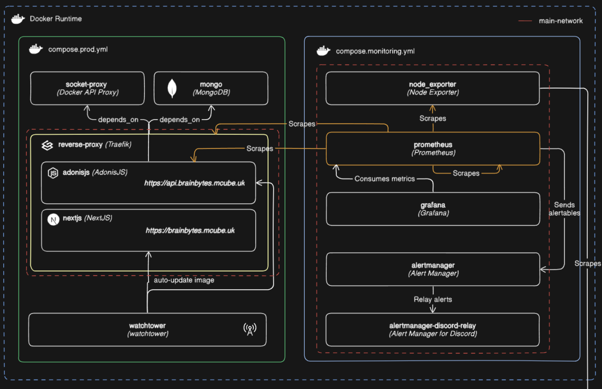
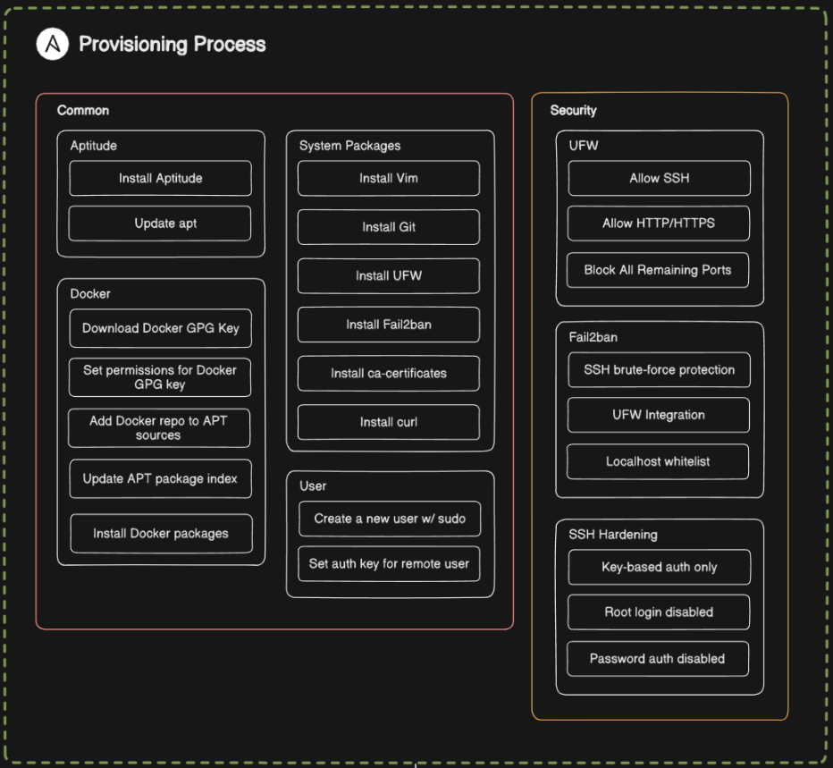
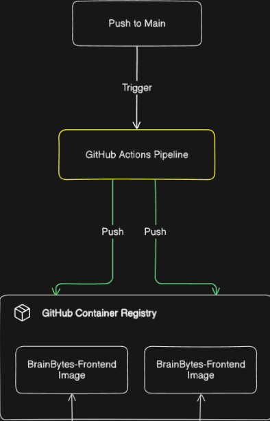
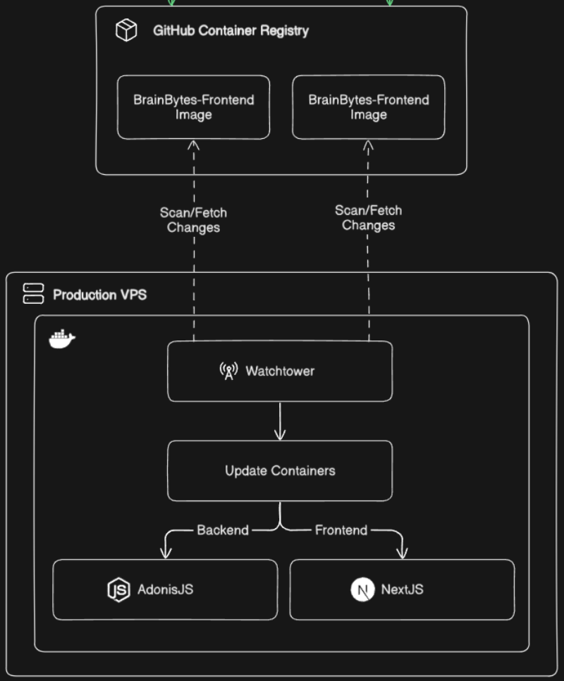

# 🖥️ Terminal Assessment

---

## 📌 Agenda / Topics / Activities

- **System Architecture**
- **DevOps Implementation**
- **Live Demonstration**
- **Documentation Overview**
- **Lessons Learned**

---

## 📖 Introduction

_Content here_

---

## 🧱 System Architecture

_Content here_

---

## ⚙️ DevOps Implementation

1. Containerization Strategy
2. CI/CD Pipeline Workflow
3. Cloud Deployment Process
4. Monitoring Setup
5. Operation Procedures

---

### 📦 Containerization Strategy

---

### 🔁 CI/CD Pipeline Workflow

#### 🛠️ GitHub Actions

- Triggers automatically on pushes to `main` / `develop` branches.
- Runs on Pull Requests targeting protected branches.

---

### ☁️ Cloud Deployment Process

- **Hosting**: OVHCloud Virtual Private Server
  - 2 vCores
  - 2 GB vRAM
  - 40 GB SSD
  - Ubuntu LTS
- **Provisioning**: Ansible
- **Image Updates**: Watchtower
- **Routing & SSL**: Traefik

---

#### 🛠️ Provisioning Process

---

#### 🚀 Push to GHCR

---

#### 🔄 GHCR to VPS Deployment

---

#### 🌐 Updated Images

---

### 📊 Monitoring Setup

#### 📈 Dashboards in Grafana

- **DevOps Dashboard**  
  Comprehensive view of application performance (Traefik, AdonisJS metrics).

- **System Stats Dashboard**  
  High-level overview of server health (CPU, memory, disk, network).

- **Traefik Dashboard**  
  Granular HTTP traffic details, error rates, and service performance.

---

### 🔧 Operational Procedures

#### 🛡️ Routine Maintenance

- OS Updates: **Monthly**
- Docker Engine Updates: **Quarterly**
- Container Updates: **Continuous**
- Security Patches: **Immediate**

---

#### ⏪ Rollback Protocol

---

#### 🔐 Continuous Security

- Regular updates across stack
- Audit logging enabled
- Network segmentation for monitoring

---

## 🚀 Live Demonstration

_To be presented live._

---

## 📚 Documentation Overview

> ## "The Single Source of Truth"

Our documentation is the blueprint for our platform. It's designed to be:

| 🔍 **Comprehensive** | 👥 **Team-Focused** | 🏗️ **Well-Structured** |
| :--- | :--- | :--- |
| Integral to our development process from day one. | Built for developers, operators, and new team members. | Designed for accessibility and easy navigation. |

## **Documentation Structure**

Our documentation is organized into four key pillars to ensure clarity and easy access to information.

| 📚 System & Architecture | 🚀 Deployment & CI/CD |
| :--- | :--- |
| • [System Design](../system-design-documentation.md) • [Cloud Environment](../cloud-env-documentation.md) • [Simulation Environment](../simulation-documentation.md)  ***Focus:*** *Container setup, hosting, networking, security, and service interactions.* | • [Deployment Plan](../deployment-plan-documentation.md) • [CI/CD Workflow](../workflow-documentation.md) • [Docker Setup](../docker-dev-setup.md)  ***Focus:*** *Automated provisioning, GitHub Actions, and deployment strategies.* |
| **📊 Monitoring & Alerts** | **🔧 Operations & Support** |
| • [Monitoring Setup](../monitoring-documentation.md) • [Alerting System](../alerts-documentation.md) • [Monitoring Demo](../monitoring-demo-script.md)  ***Focus:*** *Prometheus metrics, Grafana dashboards, alert rules, and operational playbooks.* | • [Operational Runbook](../operational-runbook.md) • [Troubleshooting Guide](../troubleshooting-guide.md) • [Environment Setup](../environment-setup.md)  ***Focus:*** *Step-by-step procedures for operations, incident response, and issue resolution.*|

---

## **Operational Runbooks**

> Actionable playbooks for real-world scenarios, designed to standardize procedures and ensure consistency.

| 🔄 **Routine Operations**    | 🚨 **Incident Response** |
|:-----------------------------| :--- |
| [✅ Service Restarts & Updates](../operational-runbook.md#-restart-adonisjs-backend-service) | [🔥 High CPU/Memory Alerts](../operational-runbook.md#-handle-high-cpumemory-usage) |
| [🔐 SSL Certificate Renewal](../operational-runbook.md#-renew-ssl-certificates) | [💾 Database Restoration](../operational-runbook.md#-restore-from-backup) |
| [🔧 System Patching](../operational-runbook.md#-system-patching) | [❌ Failed Deployment Rollbacks](../operational-runbook.md#-failed-deployment-rollbacks) |
| [📦 Dependency Management](../operational-runbook.md#-dependency-management) | [🧪 CI Test Failure Analysis](../operational-runbook.md#-test-failure-analysis) |

---

## 💡 Lessons Learned: Challenges & Solutions

| Challenge | Solution |
| :--- | :--- |
| **🔍 Monitoring Complexity** Effectively collecting and visualizing metrics from multiple services (Traefik, AdonisJS, Node). | **✅ Standardized Tooling** Created a detailed metrics catalog and standardized Grafana dashboard templates for consistency. |
| **🛡️ End-to-End Security** Hardening the full stack, from the OS and network to the application layer. | **🤖 Automation with Ansible** Automated the entire security setup (UFW, Fail2ban, TLS) for repeatable, secure deployments. |
| **⚙️ CI/CD Pipeline Reliability** Intermittent test failures in GitHub Actions that were not reproducible locally. | **📝 Robust Analysis Procedures** Developed clear failure analysis procedures, including artifact capture (logs, screenshots) and a local reproduction guide. |

>  💡 **Key Insight:** Proactive documentation, especially for runbooks and alerts, was critical to overcoming these challenges and improving team efficiency.

---
## **Future Improvements**

| 📈 Auto-Scaling | 👁️ Enhanced Observability | 🚀 Advanced Deployments |
| :--- | :--- | :--- |
| Implement dynamic resource allocation based on Prometheus metrics. | Integrate centralized logging with a tool like **Loki**. | Implement **Canary Releases** for safer, incremental updates. |
| Optimize for both performance and cost-efficiency. | Correlate metrics with application logs for faster troubleshooting. | Explore Blue-Green deployment strategies for zero-downtime releases. |

---
<!-- _class: lead -->

# **Q&A**

## Thank You!

*Any Questions?*
