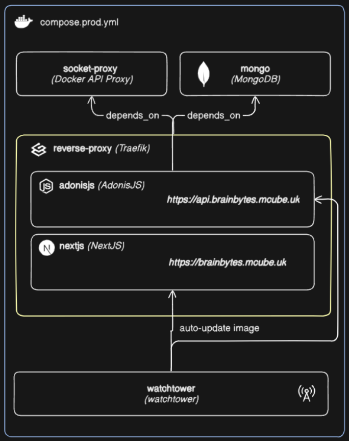
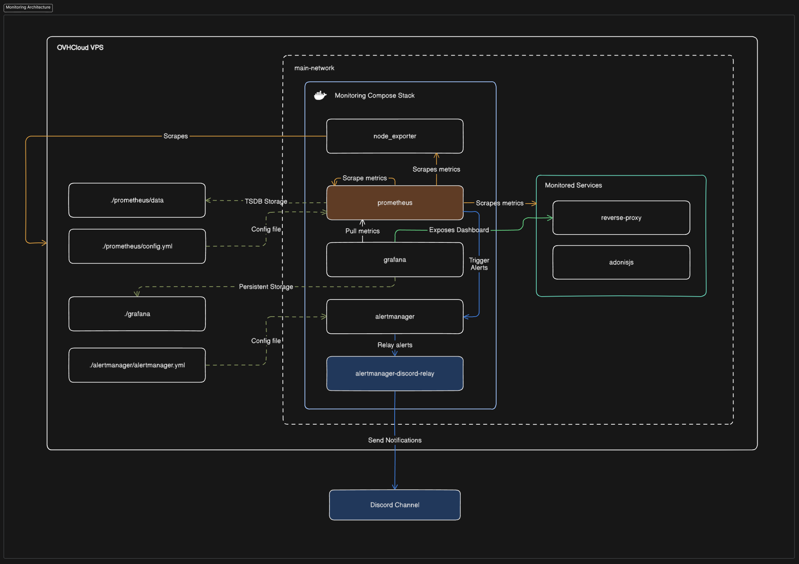
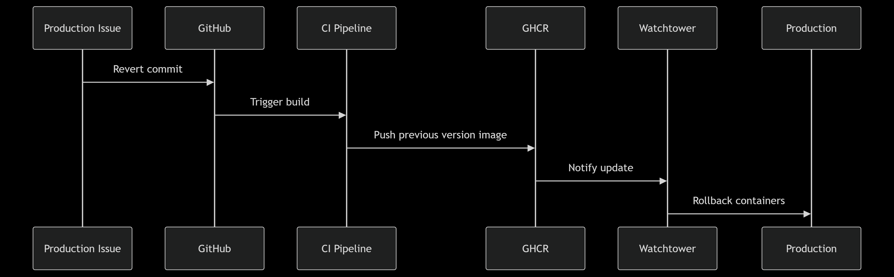

# 🖥️ Terminal Assessment

---

## 📌 Agenda / Topics / Activities

- **System Architecture**
- **DevOps Implementation**
- **Live Demonstration**
- **Documentation Overview**
- **Lessons Learned**

---

## 📖 Introduction

_Content here_

---

## 🧱 System Architecture

_Content here_

---

## ⚙️ DevOps Implementation

1. Containerization Strategy
2. CI/CD Pipeline Workflow
3. Cloud Deployment Process
4. Monitoring Setup
5. Operation Procedures

---

### 📦 Containerization Strategy

---

### 🔁 CI/CD Pipeline Workflow

#### 🛠️ GitHub Actions

- Triggers automatically on pushes to `main` / `develop` branches.
- Runs on Pull Requests targeting protected branches.

---

### ☁️ Cloud Deployment Process

- **Hosting**: OVHCloud Virtual Private Server
  - 2 vCores
  - 2 GB vRAM
  - 40 GB SSD
  - Ubuntu LTS
- **Provisioning**: Ansible
- **Image Updates**: Watchtower
- **Routing & SSL**: Traefik

---

#### 🛠️ Provisioning Process

---

#### 🚀 Push to GHCR

---

#### 🔄 GHCR to VPS Deployment

---

#### 🌐 Updated Images

---

### 📊 Monitoring Setup

#### 📈 Dashboards in Grafana

- **DevOps Dashboard**  
  Comprehensive view of application performance (Traefik, AdonisJS metrics).

- **System Stats Dashboard**  
  High-level overview of server health (CPU, memory, disk, network).

- **Traefik Dashboard**  
  Granular HTTP traffic details, error rates, and service performance.

---

### 🔧 Operational Procedures

#### 🛡️ Routine Maintenance

- OS Updates: **Monthly**
- Docker Engine Updates: **Quarterly**
- Container Updates: **Continuous**
- Security Patches: **Immediate**

---

#### ⏪ Rollback Protocol

---

#### 🔐 Continuous Security

- Regular updates across stack
- Audit logging enabled
- Network segmentation for monitoring

---

## 🚀 Live Demonstration

_To be presented live._

---

## 📚 Documentation Overview

_Content here_

---

## 💡 Lessons Learned

_Content here_
