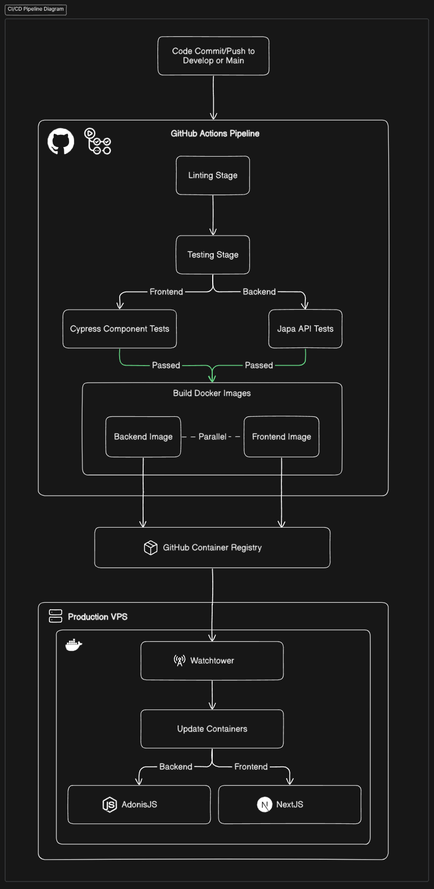
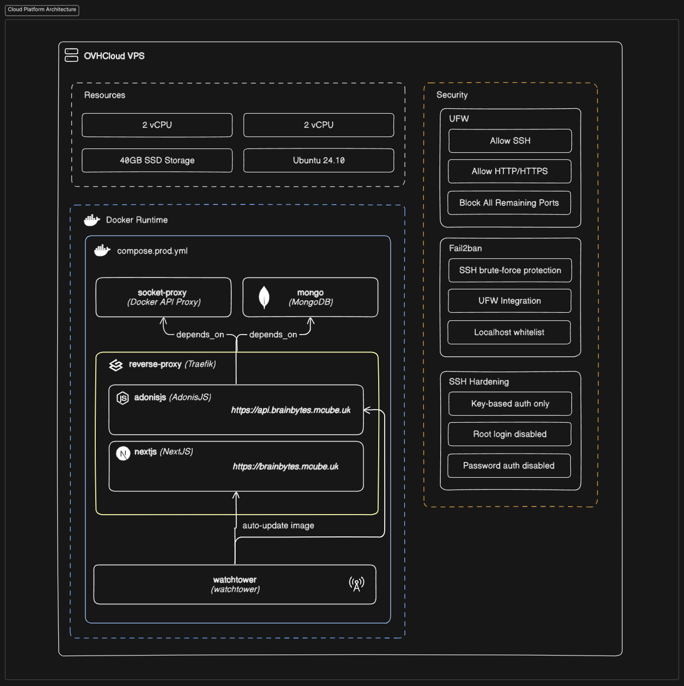
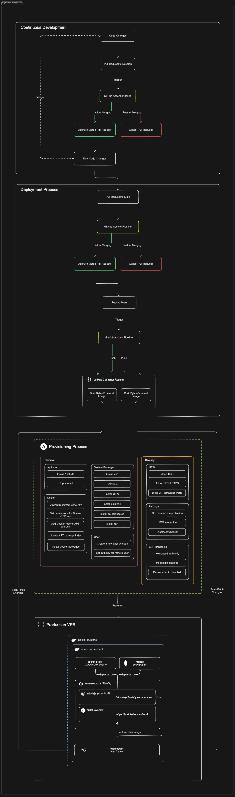
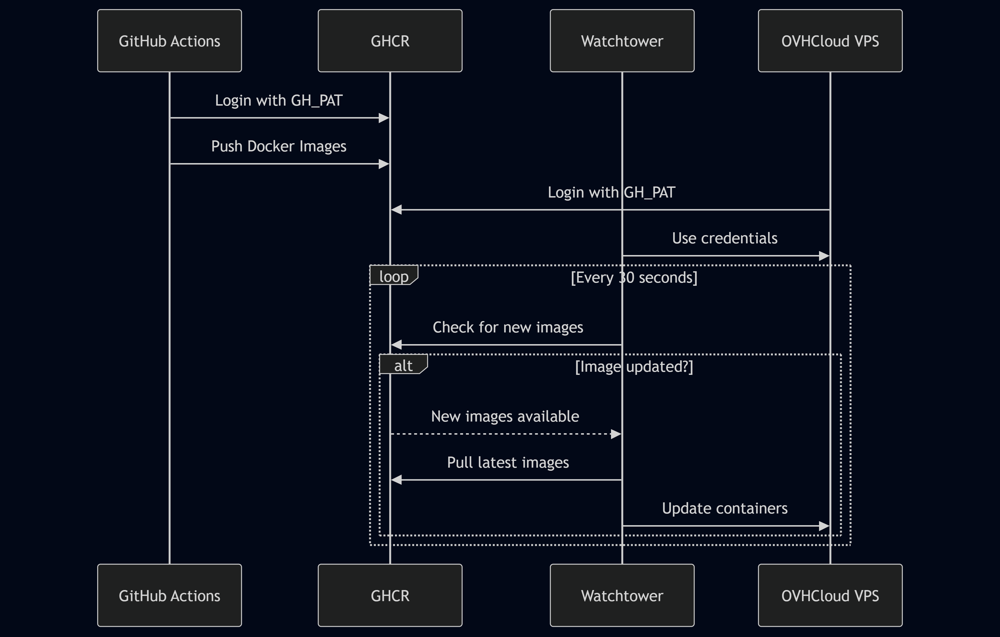
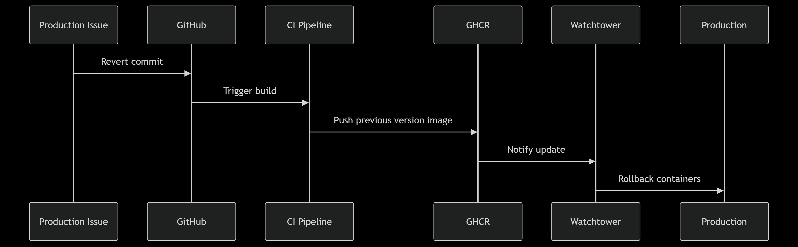

# BrainBytes AI Tutoring Platform System Design Documentation

## Introduction
### Project Overview
BrainBytes is an AI-powered tutoring platform designed to provide accessible academic assistance to Filipino students. The platform is implemented using modern DevOps practices and containerization to deliver a robust, scalable solution with these key characteristics:

- **Containerized Architecture**: Microservices deployed via Docker containers
- **Automated CI/CD**: GitHub Actions pipeline for continuous integration/deployment
- **Cloud Deployment**: Hosted on OVHCloud Virtual Private Server (VPS)
- **Security-First Approach**: Multiple security layers including firewall, intrusion prevention, and TLS encryption

### Milestone 2 Objectives
1. Implement containerized application with Docker networking
2. Create automated CI/CD pipeline using GitHub Actions
3. Deploy application to OVHCloud VPS
4. Implement security hardening for production environment
5. Establish monitoring and observability foundations

### Team Responsibilities
| Role               | Team Member             | Key Responsibilities                          |
|--------------------|-------------------------|----------------------------------------------|
| Team Lead          | Kristopher Santos       | Project coordination, architecture decisions |
| Backend Developer  | Harvey Dela Flor        | AdonisJS API, MongoDB integration            |
| Frontend Developer | Ibrahim Desouky Harby   | Next.js UI, component testing                |
| DevOps Engineer    | Mark Rolis Valenzuela   | CI/CD pipeline, cloud deployment, security   |

---

## CI/CD Implementation

### Pipeline Architecture
 *Figure: CI/CD Pipeline Diagram*

GitHub Actions orchestrates the CI/CD pipeline with the following characteristics:
- **Triggers**: 
  - Automatic on pushes to `main`/`develop` branches
  - Pull requests targeting protected branches
  - Manual execution via `workflow_dispatch`
- **Execution Sequence**:
  1. Code checkout
  2. Dependency installation
  3. Linting (ESLint + Prettier)
  4. Testing (Japa + Cypress)
  5. Docker image build & push to GHCR
  6. Watchtower-initiated deployment

### GitHub Actions Workflow
**Primary Workflow File**: `./github/workflows/automation.yml`

| Stage           | Components                           | Critical Actions                                  |
|-----------------|--------------------------------------|--------------------------------------------------|
| **Linting**     | Frontend & Backend                   | ESLint validation, Prettier formatting checks    |
| **Testing**     | Backend: Japa tests                  | API endpoint validation, service unit tests      |
|                 | Frontend: Cypress component tests    | UI component interaction verification             |
| **Build/Push**  | Docker image construction            | Multi-stage builds for optimized production images|
|                 | GHCR Image Upload                    | Tagged push to `ghcr.io/morfusee/brainbytes-*`   |

### Integration with Containerized Application
The application is containerized using Docker Compose, which orchestrates multiple services:

```
services:
  socket-proxy:    # Secured Docker socket access
  reverse-proxy:   # Traefik for ingress routing
  mongo:           # MongoDB database
  adonisjs:        # Backend API (Node.js)
  nextjs:          # Frontend (Next.js)
  watchtower:      # Automatic container updates
```

| Service          | Description                                                                                             |
| :--------------- | :------------------------------------------------------------------------------------------------------ |
| `socket-proxy`   | A security measure to prevent direct `docker.sock` mounting.                                            |
| `reverse-proxy`  | Uses Traefik to handle ingress traffic, routing, and SSL/TLS termination for the frontend and backend.  |
| `mongo`          | The MongoDB database instance.                                                                          |
| `adonisjs`       | The backend application, built with Node.js.                                                            |
| `nextjs`         | The frontend application, built with Next.js.                                                           |
| `watchtower`     | Continuously monitors for new Docker image versions in the registry and automatically updates running containers. |

### Testing Strategy in the Pipeline
The `automation.yml` workflow includes a dedicated test job to validate the application's functionality:

* **Code Quality**: ESLint is used for linting, and Prettier for code formatting, ensuring consistent code style across both frontend and backend.
* **Backend API Tests**: The pipeline runs `pnpm test` within the `./backend` directory, utilizing Japa as the testing framework. These tests cover unit and integration aspects of the backend API.
* **Frontend Component Tests**: The pipeline utilizes Cypress to run `pnpm test:component-headless` from the root directory. These tests are designed to validate the isolated UI components and their basic interactions.

---

## Cloud Deployment

### Cloud Platform Architecture
The application is deployed on an OVHCloud Virtual Private Server (VPS).

* **Hardware**: The VPS has 2 vCores and 2 GB vRAM.
* **Operating System**: Ubuntu
* **Container Runtime**: Docker Engine is installed and managed on the VPS.

 *Figure: Cloud Platform Diagram*

### Resource Configuration

| Component       | Specification           | Notes                                  |
|-----------------|-------------------------|----------------------------------------|
| Provider        | OVHCloud                | Virtual Private Server (VPS)           |
| vCPU           | 2 cores                 | Shared hyperthreading                 |
| RAM            | 2GB                     | DDR4                                  |
| Storage        | 40GB SSD                | Persistent storage              |
| OS             | Ubuntu LTS        | Minimal installation                  |
| Container Runtime | Docker Engine 24.x      | N/A               |


### Networking and Security Setup
The Ansible playbook automates the networking and security configuration on the VPS:

* **Firewall**: UFW (Uncomplicated Firewall) is used to:
    * Allow incoming SSH connections (on a configurable `ssh_port`).
    * Enable and deny all other incoming connections by default.
* **Intrusion Detection/Prevention**: Fail2ban is configured to:
    * Protect against brute-force attacks on SSH.
    * Ignore internal IP addresses (`127.0.0.1/8`).
    * Use UFW as the banning action.
* **SSH Security**:
    * Password authentication is disabled.
    * Root login is prohibited with a password (`PermitRootLogin prohibit-password`).
    * SSH key-based authentication is enforced for the `created_username` user.

### Deployment Process Flow

 *Figure: Deployment Process Flow Diagram*
1.  **VPS Provisioning**: Ansible playbook (`playbook.yml`) is run to set up the necessary environment on the OVHCloud VPS. This includes installing Docker, configuring security tools (UFW, Fail2ban), and setting up SSH access.
2.  **Image Building & Pushing**: GitHub Actions builds the Docker images for the backend and frontend and pushes them to GitHub Container Registry (GHCR). This happens on every push to `main` (for `latest` tag) or `develop`, and on PRs.
3.  **Application Deployment**: Once new images are available in GHCR, Watchtower, running on the VPS, automatically pulls the updated images and restarts the corresponding Docker containers.
4.  **Traffic Management**: Traefik handles incoming HTTP/HTTPS requests, routes them to the correct `adonisjs` (backend) or `nextjs` (frontend) containers, and manages SSL certificates via Let's Encrypt (implied by Traefik configuration).

---

## Integration Points

### How GitHub Actions Connects to Our VPS
 *Figure: How GitHub Actions Connects to Our VPS Diagram*
* **Image Registry**: GitHub Actions integrates with GHCR by logging in (`docker/login-action`) using a GitHub Personal Access Token (`GH_PAT`) and then pushing the built Docker images.
* **Automatic Deployment**: The Watchtower service running directly on the OVHCloud VPS pulls the latest images from GHCR. This means GitHub Actions itself doesn't directly deploy to the VPS, but rather pushes artifacts that trigger an update on the VPS.

### Environment Variable Management and Secrets Handling

| Environment | Method | Secrets Handling |
|---|---|---|
| **Development** | `.env` files | Git-ignored local files, manually created from `.env.example` |
| **CI/CD** | GitHub Actions Secrets | Encrypted secret store within GitHub Actions, injected at runtime |
| **Production** | Manual VPS transfer | Secured SSH file transfer, typically placed in a `.env` file on the VPS with restricted permissions (e.g., `chmod 600`) |

**Critical Secrets**:
* `APP_KEY`: Essential for backend encryption, ensuring data integrity and security.
* `GEMINI_KEY`: API key for integrating with the Gemini AI service.
* `MONGO_ATLAS_URI`: Connection string for the production MongoDB Atlas database.
* `MONGO_DOCKER_URI`: Connection string for the local Dockerized MongoDB instance used during development and testing.

### Artifact Management
The primary artifacts of the BrainBytes CI/CD pipeline are containerized Docker images, which are managed and versioned in the GitHub Container Registry.

| Artifact Type | Registry Location | Tagging Strategy |
|---|---|---|
| **Backend Docker Image** | `ghcr.io/morfusee/brainbytes-backend` | `latest` (for `main` branch pushes) |
| **Frontend Docker Image** | `ghcr.io/morfusee/brainbytes-frontend` | `latest` (for `main` branch pushes) |


---

## Testing and Validation

### Pipeline Testing Procedures

As detailed in the `workflow-documentation.md` and [CI/CD Pipeline Diagram](images/pipeline-diagram.png):

* **Code Quality**: ESLint is used for linting, and Prettier for code formatting, ensuring consistent code style across both frontend and backend.
* **Backend Tests**: `pnpm test` runs API-level tests for the backend, utilizing Japa as the testing framework. These tests cover **unit and integration** aspects of the backend API.
* **Frontend Component Tests**: `pnpm test:component-headless` runs Cypress component tests for the frontend. These tests are designed to validate the isolated UI components and their basic interactions.


### Deployment Validation
Deployment verification ensures that the application is running correctly and as expected after a deployment. This involves automated checks within the CI/CD pipeline and runtime monitoring.

1.  **Pipeline Gates**:
    * **Linting and Testing Success**: The CI/CD pipeline is configured with strict gates. If the linting or testing stages fail, the pipeline will halt, and Docker images will **not** be built or pushed to GHCR. This prevents the deployment of broken code.
    * **Image Build Success**: The successful construction of Docker images is a prerequisite for further deployment.
2.  **Runtime Checks on VPS**:
    * **Traefik Health Monitoring**: The Traefik dashboard and logs are actively monitored to ensure that the reverse proxy is correctly routing traffic to the backend and frontend services. Any routing errors or unhealthy service indications are immediately visible.
    * **Container Status Checks**: We regularly check the status of individual Docker containers on the VPS to ensure they are running, healthy, and not restarting unexpectedly.
        ```bash
        docker ps --format "table {{.Names}}\t{{.Status}}\t{{.Ports}}"
        ```
        This command provides a quick overview of running containers, their status, and exposed ports.
3.  **Smoke Testing**:
    * **Endpoint Validation**: Basic tests can be used (e.g., via `curl` commands) to hit critical API endpoints and verify expected responses.
    * **Manual UI Verification**: After a deployment, a quick manual verification of key user interface functionalities (e.g., login, navigation, core features) is performed to ensure the frontend is rendered correctly and interactive.


### Rollback Procedures
In the unlikely event that a deployed version introduces critical issues, a robust rollback procedure is in place to quickly revert to a previous stable state.




### Monitoring and Observability
The team is currently planning to implement **Grafana and Prometheus** for comprehensive monitoring.
For immediate network monitoring, the **Traefik Dashboard** is used to observe networking activity and service status.


---

## Operational Guide

### Troubleshooting Procedures

This matrix provides a quick reference for diagnosing and resolving common issues encountered during the CI/CD process or in the deployed application.

| Symptom | Investigation Steps | Resolution Actions |
|---|---|---|
| **Pipeline lint failure** | Check ESLint output in GitHub Actions logs for specific errors. | Fix code style violations in the problematic files and push changes. |
| **Pipeline test failure** | Review Japa (backend) or Cypress (frontend) output in Actions logs; verify `secrets` usage. | Debug failing tests locally; ensure all required environment variables are passed to the test job. |
| **Docker build failure** | Inspect Docker build logs in GitHub Actions for syntax errors, missing files, or permission issues. | Correct `Dockerfile` errors; ensure `GH_PAT` has correct permissions; check build context. |
| **Container startup failure** | Execute `docker logs <container_id_or_name>` on the VPS for startup errors or crashes. | Verify environment variables loaded by Docker Compose; check for missing dependencies or configuration errors within the container. |
| **API connection issues (from frontend to backend)** | Use `curl -I http://adonisjs:3333/health` from within the `nextjs` container (if network allows) or from the host; check `adonisjs` container logs. | Confirm `adonisjs` container is running and healthy; verify internal Docker network connectivity. |
| **Traefik routing errors (external access)** | Access the Traefik dashboard (if enabled, typically on port 8080) for router/service status; check Traefik container logs. | Verify Traefik router and service configurations in `docker-compose.yml`; check for port conflicts or incorrect domain mappings. |
| **Application not responding** | `docker ps` to check if all services (mongo, adonisjs, nextjs, traefik) are running; check system resource usage (`htop`, `free -h`). | Restart individual containers or `docker compose restart`; scale up VPS resources if consistently under heavy load. |
    
### Maintenance Tasks
| Task | Frequency | Automation Level | Command/Tool |
|---|---|---|---|
| **OS Updates** | Monthly | Manual | `sudo apt update && sudo apt upgrade -y` |
| **Docker Engine Updates** | Quarterly | Manual | `sudo apt install docker-ce docker-ce-cli containerd.io docker-buildx-plugin docker-compose-plugin` (follow Docker installation guide) |
| **Container Updates** | Continuous | Full (Watchtower) | Auto-managed by Watchtower, polling GHCR every 30 seconds |
| **Security Patches** | Critical | Immediate Manual Intervention | `sudo apt update && sudo apt upgrade -y` for OS patches; application-specific updates as needed (triggering CI/CD) |

### Security Management

Security is a cornerstone of the BrainBytes platform, implemented through a multi-layered approach covering the network, application, and secrets management.

---

#### Network Security

- **Default-Deny Firewall (UFW)**:  
  All incoming connections are blocked by default. Only essential ports — such as SSH (on a non-standard port) and HTTP/HTTPS (via Traefik) — are explicitly allowed.

- **Fail2ban Intrusion Prevention**:  
  Monitors authentication logs and automatically bans suspicious IP addresses, proactively mitigating brute-force attacks.

---

#### Application Security (via Traefik)

- **TLS Enforcement**:  
  Enforces TLS 1.2 or higher for all HTTPS traffic to ensure secure encryption.

- **Strong Cipher Suites**:  
  Only modern, secure cipher suites are enabled for encrypted communications.

- **Security Headers**:  
  Traefik injects critical HTTP headers to strengthen browser-side protections:
  - `Strict-Transport-Security`: Enforces HTTPS via HSTS.
  - `X-XSS-Protection: 1; mode=block`: Blocks reflected XSS attacks.
  - `X-Content-Type-Options: nosniff`: Prevents MIME-sniffing.
  - `X-Frame-Options: DENY`: Blocks clickjacking via iframes.

- **Sensitive File Access Controls**:  
  Middleware rules are used to block access to sensitive files such as `.env`, `.git`, and `docker-compose.yml`, preventing unintended exposure.

---

#### Secrets Management

- **Encrypted GitHub Actions Secrets**:  
  All CI/CD credentials are securely stored in GitHub Actions as encrypted secrets, keeping them out of logs and version control.

- **Production `.env` File Hardening**:  
  The `.env` file on the VPS is secured with strict permissions (`chmod 600`), allowing access only to the intended system user.

- **No Secrets in Version Control**:  
  Sensitive credentials and API keys are explicitly excluded from Git repositories to uphold security best practices.


